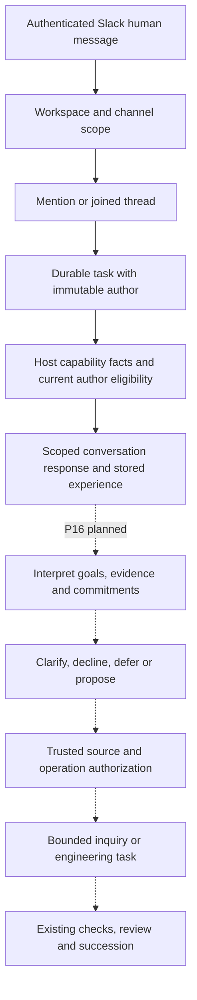

# ADR 0014: Open conversation with separate self-modification suggestion authority

- **Status:** Accepted user direction; immediate conversation/authority/provenance slice implemented and verified with deterministic checks. Cognitive deliberation and proposal/growth dispatch remain planned.
- **Recorded:** 2026-10-08.
- **Requirements:** R04, R18–R19, R23–R24.
- **Supersedes:** ADR 0013's conversation user allowlist only. Its authenticated workspace/channel scope, mention/joined-thread boundary, duplicate identity and bot/subtype/DM exclusions remain.

## Context

The user wants Slack conversations to feed internal processes through cognition, with interpretation and independent judgment rather than verbatim obedience. Palimpsest should converse with all Slack users, while only the whitelist may originate self-modification suggestions. The existing transport user gate combines those two decisions and blocks ordinary dialogue from everyone outside the whitelist.

The accepted operational interpretation is all human participants in configured workspaces/channels using mentions or joined-thread replies. It does not subscribe Palimpsest to unsolicited conversations or add DMs. Broader conversation must not allow a participant's suggestion to acquire another participant's authority merely because they share a thread.

## Decision

Separate conversation admission, suggestion eligibility, cognitive judgment, operation authority and release admission:

| Decision | Trusted input / boundary |
|---|---|
| Admit a conversation message | Authenticate Slack delivery; apply configured workspace/channel scope and mention/joined-thread filtering; exclude bots/subtypes/DMs. Do not require membership in the modification whitelist. |
| Identify its human source | Preserve authenticated Slack workspace/user identity as immutable external task metadata. Reject conflicting duplicate authors. Text and model-generated identity claims are not evidence. |
| Consider a human self-modification suggestion | Assess the message author's membership in the current host whitelist. Missing legacy author facts confer no eligibility. Membership permits consideration, not automatic adoption. |
| Choose what to do | Planned deliberation weighs goals, evidence, commitments, resource bounds and authority; it may clarify, disagree, decline, defer or propose work. |
| Execute or release a proposed change | Planned trusted dispatch checks source eligibility and configured operation authority; existing candidate checks, fresh review, succession and recovery gates still apply. |

Use `SLACK_SELF_MODIFICATION_USER_IDS` for the new whitelist, falling back to legacy `SLACK_ALLOWED_USER_IDS` only when the new variable is absent. An explicitly empty new variable denies every Slack human self-modification eligibility. Team and channel settings retain their existing scope semantics. Host policy is assessed at use, rather than treating the historical task or an old whitelist result as permanent authorization.

The immediate implementation retains `slackAuthor` on a task and supplies current author eligibility, per-memory source facts and truthful capability/storage facts after candidate request construction. These facts come from the trusted host, independently of candidate prompt text. In a shared thread, status remains visible in that thread; cancellation and correction require the original task's Slack author, and a correction retains its command author's provenance. A broad conversation grant does not grant other task-control powers. The bearer-authenticated local operator retains whole-seed controls. The candidate receives exactly the last twelve scoped memories; the host labels that same set, so selecting older unlabelled memories cannot omit source restrictions.

### Cognition and provenance obligations

Conversation is experience, not automatically an engineering instruction. Ordinary exchanges may inform relationships, beliefs, curiosity and independently evaluated observations. A nonwhitelisted human's request to modify Palimpsest must remain ineligible as a human-origin suggestion through quotation, retrieval, consolidation, handoff and growth. Another participant's whitelist membership cannot be borrowed. Merely paraphrasing a restricted instruction or calling it autonomous growth does not authorize it.

Standing autonomous growth remains required under R01 and [GROWTH.md](../../GROWTH.md). It can reach independently justified conclusions, but the future dispatcher must distinguish those observations from acting on a restricted human instruction and preserve the evidence for that distinction. Exact source-aware deliberation, derived-memory records and dispatch checks require their own tested design; this ADR does not claim they exist.

## Alternatives and consequences

Keeping the transport user allowlist rejects the requested broad conversation. Removing it with no immutable source facts allows a later thread participant to inherit apparent authority. Encoding roles in message text or candidate prompts makes claims forgeable. Treating every whitelist message as a command removes judgment and does not establish tool or release authority. Banning all learning from nonwhitelisted humans would also conflict with open conversation and the developing companion's independent interests.

More human participants can use the existing shared inference budget; this decision grants no larger budget. Participants admitted to the same thread share its scoped conversational context. Authenticated authorship establishes provenance, not truth: an authorized author can still supply mistaken, quoted or unsuitable material. Legacy anonymous records remain conversational history with unknown authority. New source facts do not retroactively prove the origin of old memories.

## Implementation and verification boundary

The immediate work item is [P04's authority refinement](../../PLAN.md#p04-refinement--conversation-admission-and-modification-authority): both Slack transports, durable immutable authorship, current host eligibility and memory-source facts, truthful capabilities, and same-author correction/cancellation. Verify mixed authors, restarts, duplicate ordering/conflicts, empty/new/legacy whitelist configuration, hostile identity claims and candidate attempts to replace host facts. Record executed results before marking this slice verified.

[P16](../../PLAN.md#p16--connect-conversation-to-real-capabilities-and-governed-work) still owns deliberation, a conversation-to-growth feed, source-aware memory derivation and actual tool/proposal/Git integration. Host facts and storage provenance are a policy foundation; they are not an implemented privileged action boundary. No source-modification dispatcher is supplied by this slice, and no model statement is evidence of a completed action.

## Flow and verification boundary

Solid edges describe this slice. Dashed edges are unfinished P16 integration, not a running dispatcher. Deterministic verification covers open human admission through signed HTTP and Socket Mode, explicit blank/legacy whitelist behavior, persisted authors across restart, duplicate-author conflicts, anonymous legacy retries, same-author Slack controls, current policy after revocation, forged direct metadata rejection and candidate mutation resistance. A live quality probe and conversation-driven source change require separate evidence.
