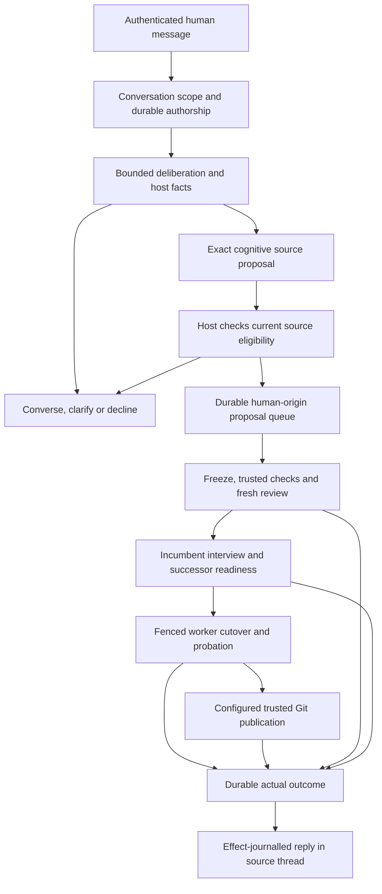

# ADR 0015: Deliberative conversation to governed cognitive self-modification

- **Status:** Accepted bounded implementation; integrated mechanics and a live direct-operator Mistral shed with production remote publication verified. Live Slack-origin release and full acceptance matrix pending.
- **Recorded:** 2026-10-08.
- **Requirements:** R04, R10–R19, R21–R24.
- **Extends:** [ADR 0014](0014-conversation-and-modification-authority.md), retaining its conversation admission and authenticated suggestion eligibility boundaries.
- **Specification:** [Conversational self-modification](../conversation-self-modification.md).

## Context

The user explicitly requests implementation so they can have a self-modification interaction. At the start of this work the Slack model truthfully reported no conversational dispatcher or Git publisher, even though a separate evolution coordinator could evaluate and promote cognitive source. Merely changing that answer would have claimed nonexistent action. Exposing a shell would enlarge authority and bypass the existing candidate/recovery contracts.

## Decision

Use a trusted host deliberation/dispatch lane with one validated structured decision: reply, disposition, rationale and optional exact source proposal. Keep ordinary conversation open to all admitted humans while only authenticated whitelisted authors may originate human proposals. Supply actual admitted cognitive source and exact contracts for generation; exclude other-author historical instruction memory from the proposal lane. Preserve and recheck source eligibility independently of model judgment. Direct testing uses an explicitly trusted operator boundary.

Persist the decision and an exact human-origin growth proposal bound to the source task. Process the durable release queue separately from conversation completion, preventing self-dependent quiescence during cutover. Use a bounded durable human-request allocation distinct from the autonomous daily growth allocation: at most 8 release calls per attempt and 8/day by default; ordinary proposal inference has its own task budget. Reuse frozen mandatory checks, independent review, role-bound interview, custodian cutover and probation. The candidate cannot redefine those gates.

A trusted publisher may commit/push exact admitted bytes after successful probation when explicit host configuration authorizes a fixed repository/remote/branch, including matching sole effective fetch/push URL identity. Source text cannot choose destinations, commands or arbitrary paths. Disable Git hooks, run bounded asynchronous Git operations, hold dirty/conflicting/divergent state and reconcile unknown push outcomes. A durable effect-backed result queue reports real proposal, release and publication outcomes to the source thread. Local promotion and remote publication are separate facts.

This first slice admits only direct `src/agent/*.ts` changes and replaces the restricted cognitive worker. The CLI supplies admitted `brain.ts` plus bounded contract excerpts, growth mission and engineering rules; additional helpers are not automatically exposed as source context. `serve` executes the release queue; `ask` can record a proposal but exits before that scheduler starts. Outer Slack service rebuild/relaunch, host tooling/custodian evolution and broader repository work remain separate contracts.

The diagram is the accepted design, not evidence of implementation. Failed eligibility/gates do not progress to admission; publication disabled/failure can leave an admitted local successor with an explicit unpublished outcome.

## Alternatives

- **Prompt-only capability correction:** Can improve answers but cannot deliver the requested action or enforce source restrictions. Retain accurate facts as support, not as implementation.
- **General tool/shell agent:** Could cover broader engineering work, but expands writable scope and external effects before authority/recovery contracts exist. Defer broader P16 tooling.
- **Directly evolve inside the conversational task:** Simpler surface, but cutover can wait for the very task awaiting cutover. A separate durable queue also makes cancellation/restart and later outcome reporting explicit.
- **Reuse autonomous daily budget for all requests:** Keeps a single counter, but already consumed idle growth can block an explicit human interaction. Use distinct bounded allocations without silent refills.
- **Treat any permitted conversation as growth authorization:** Loses the whitelist's source restriction across summaries and later scheduling. Preserve human provenance and independent standing growth separately.
- **Always push after a generated proposal:** Confuses candidate acceptance with publication, permits unevaluated bytes and unknown effect replay. Publish only exact admitted artifacts under configured authority.

## Consequences and validation

The user gets a real bounded self-modification interaction while Palimpsest retains independent judgment. Models generate hypotheses; the host owns permission, budgets, checks, release and effects. More durable state and failure dispositions are necessary across deliberation, succession, Git and Slack.

The integrated real-host check passed: Slack-authored request, exact proposal, protected checks, five deterministic-provider release calls, actual restricted worker succession/probation, exact publication into a local bare remote, durable original-thread result and successor follow-up behavior. Focused checks establish author/policy filtering, protected-path rejection, other-author context exclusion, direct cancellation, recorded-decision resumption and publication holds for destination removal/mismatch, dirty checkout, divergent history and retained unknown push outcomes. See the linked specification and [integration test](../../test/conversation-release.test.ts).

Live direct-operator evidence subsequently established a Mistral-authored candidate, five release calls, checked cutover/probation and application publication of exact admitted source as `f3def48`, independently observed on the configured remote. See [progress](../progress.md). This does not establish a live Slack-origin release or close all P16/qualitative acceptance. The full restart/interruption/provider failure/publication reconciliation and truthful live-answer matrix remains required. The accepted implementation remains a bounded interaction, not general host self-deployment or autonomous plan execution.

## Follow-up in preparation — 2026-10-09

The first live plan publication required explicit operator reconciliation after an unconfirmed push. Its command failure details were discarded; the observed roughly 30-second interval cannot establish a timeout. The [diagnostic work contract](../publication-diagnostics.md) separates sanitized execution metadata from independent remote confirmation, retains the fixed target/candidate/commit and existing no-replay boundary, and moves observation backoff to operation completion. Alternatives are retaining opaque errors, retaining potentially sensitive raw streams, or automatically retrying an uncertain push. Prefer bounded metadata; raw output and replay are unsuitable. These proposed changes require tests, fresh review and separate installation; the historical failure remains undiagnosed.

## Ordinary conversation refinement — 2026-10-09

The observed naming thread exposed that putting every eligible turn through a source-proposal protocol can encourage formal planning, permission loops and overinterpretation of examples. Keep the unified strict decision/authority boundary, while supplying explicit ordinary-conversation judgment guidance and delivering nonproposal replies without unconditional engineering status. Moving source proposals to a separate user command could reduce priming but would weaken natural conversational interpretation; it remains an alternative rather than this corrective change. No new tools or identity persistence are granted. Qualitative acceptance is specified separately in [conversation judgment](../conversation-judgment.md).
