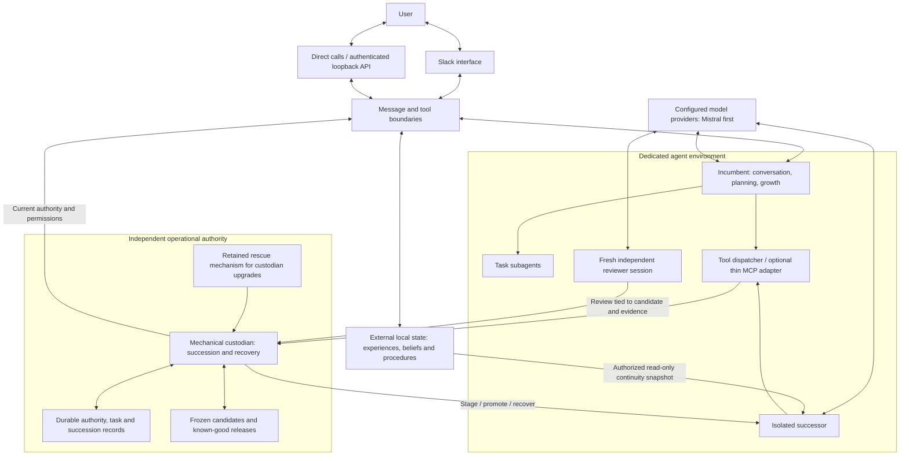

# Palimpsest architecture

Status: target architecture with a local implementation in progress, 2026-10-08. Component coverage and verification limits are in [progress](progress.md). See [requirements](../REQUIREMENTS.md), [plan](../PLAN.md), [decision records](adr/README.md), and the [source analysis](research/source-analysis.md).

The explicit 2026-10-09 direction requires basic iterative coding in the seed and autonomy over the whole codebase, potentially including library forks. [ADR 0019](adr/0019-coding-autonomy-and-reusable-agent-plumbing.md) and the [coding contract](coding-autonomy.md) define the next implementation. Current complete-file proposals and `src/agent/` admission remain a narrow implemented slice, not the target boundary.

For that implementation, ADR 0019 selects a pinned direct Mistral provider adapter behind a Palimpsest-owned single-step facade. The library handles provider protocol; the host retains tool execution, durable records, allocation, authority and succession. SDK types stay inside the adapter. Isolated typed fixtures support this choice; production configuration, dependency packaging, coding integration and actual-provider acceptance remain pending.

The current seed runs a trusted Node coordinator with durable SQLite tasks, memory and growth outside the checkout. Direct calls, authenticated loopback HTTP, and Slack adapters normalize the same ingress/egress contracts. Restricted procedure and candidate execution uses macOS Seatbelt. Process-bound generational authority and recovery are being integrated; the target diagrams below are not evidence that every boundary already exists. Operational APIs and restrictions are documented in [communications](communications.md), [providers](providers.md), [isolation](isolation.md), and [procedures](procedures.md).

The [local peer role](peer-conversation.md) adds a separate credential and restricted routes to that loopback surface. Trusted ingress assigns peer source and a reserved scope; task controls and memory retrieval check peer provenance before data/effects. Peer conversation uses the same configured runtime/model but cannot enter the eligible source-proposal lane. Public exposure and confidentiality of information already in scope remain separate acceptance obligations under R25/A21.

The installed [scoped continuity slice](work-items/p16-conversation-continuity.md) separates exchange delivery, source-linked interpretation, durable topic/report obligation and optional reflection. Reflection shares existing growth allocation and checks current sources, topic revision and expiry before dispatch/publication. A no-inference review prepares reports through the original communication effect path; only current final delivery or explicit waiver clears the obligation. Peers can retain outcomes and reports but cannot admit reflection. Reopened scoped retrieval is fixture-verified; broader live reflective judgment remains open.

Current-turn dispatch flags are separate from configured global capabilities. Selected memory source facts identify the stored transport and exact recorded proposal presence; neither memory text nor a proposal record establishes human authentication, truth or a completed release. Actual provider tests improved fresh role interpretation but still misrepresented historical peer exchanges, so these facts guide fallible cognition while receiving boundaries enforce authority.

## Direction and provenance

Palimpsest is the repository for a continuing autark with memory, personality, commitments, and interests. Coding remains a required capability; the user's explicit 2026-10-10 direction removes a fixed coding-companion identity and a hardcoded personal name. An assistant recap in the recovered discussion preserves Slack as the primary interface, Mistral-first inference with explicit alternatives, a small understandable seed, and eventual ability to improve the whole agent environment. The user accepted combining that direction with stronger engineering safeguards; the earlier user messages themselves were not recovered. The user separately mandated spec-driven development, pragmatic TDD, the Boy Scout Rule, suitable subagent fan-out, maintained documentation, and a **strong self-improvement drive** across personality, interests, code quality, and potential.

The incumbent interviewing its successor and remaining alive through a governed handoff is the user's proposed governance direction. The detailed custodian boundary, fencing protocol, evidence formats, and MCP surface below were assistant design proposals supporting that direction. They are preserved for implementation planning, not represented as already implemented or individually ratified. The thread tool returned six turns; the colleague's attachment was separately recovered and read in full. Earlier turns and the assistant-generated specification packages remain unavailable. The [source analysis](research/source-analysis.md) records the provenance and distinguishes the attachment's proposals from adopted Palimpsest direction.

## The autark and its deliberation

[R27](../REQUIREMENTS.md) and [ADR 0029](adr/0029-autark-deliberation-and-explicit-speech.md) establish an accepted direction with a bounded source implementation; integrated review, exact installation and configured-model acceptance remain open. The continuing autark comprises its runtime, memories, senses, drives, commitments and available actions. An inference is its deliberation for a bounded interval. The shared introduction in `src/autark.ts` speaks as that whole autark and hands the model the same first-person perspective: the inference's “I” refers to the autark, not a separate adviser or an entity named “inner voice.” Describe actual supplied state and available observations/actions; a prompt cannot create a sense, memory, identity or capability.

Self-description comes from authorized current scoped state. A remembered provisional preference retains its provenance and uncertainty; a mentioned name or repository label cannot become an adopted global identity. If the supplied state does not establish a personal name or other self-fact, it remains unknown. Conversation, growth, scoped reflection, coding and memory consolidation share this perspective while retaining their distinct purposes and authority. Independent reviewers and isolated successors retain their explicit role and production-authority boundaries.

The host wraps admitted incoming speech as an observation containing exact text, source and conversation identity only after validating the candidate's context projection. `src/deliberation.ts` implements the foreground `autark-turn/1` structured host-tool protocol with zero or one `say`; it does not add native provider tool-call wire support. The model can interpret what a person said, select work, remain silent within finite limits, or request speech. Unadorned model text and internal outcome rationale are not outward speech. The receiver validates current scope and authority, rechecks source references, records the intent and uses the existing durable delivery/effect path. A tool request is not confirmation that anyone heard it. Silent completion retains a null response without a communication effect. Peer APIs expose task state and selected outward output, excluding private decision checkpoints.

Reflection uses private outcome fields plus an actions array, with selected speech retained separately against its exact source/topic revision. Prepared reports distinguish model-selected speech from fixed host operational notices; coding intervals expose no `say` and their free text remains internal. No silent interval, completed inquiry, queued action, unknown send or stale acknowledgment clears an owed current report. Existing source invalidation, cancellation, revision, receipt and recovery contracts still apply. Unattempted legacy reports can be replaced with fixed notices before any effect reservation; existing effects are not rewritten or replayed. Coding continuations overlay the current orientation for their next digested request without rewriting history or spent accounting. The [work item](work-items/autark-deliberation.md) records source evidence and acceptance/compatibility obligations; installed behavior and model judgment remain separate unverified gates.

## Components and boundaries

This is a logical component diagram, not a selected process layout, network topology, or database schema. In particular, the memory processes need not live in the custodian, and the diagram does not prescribe a memory engine.

| Component | Responsibility | Boundary |
|---|---|---|
| Incumbent | Converse while work continues; plan, pursue growth, delegate work, prepare improvements, interview successor, submit verdict | Cannot bypass mandatory checks, manufacture authoritative review evidence, or remove the recovery release |
| Successor | Demonstrate intended improvements and continuity; challenge incorrect assumptions; acknowledge readiness | Isolated during evaluation; cannot approve itself, change its own admission rules, write production memory, or retire the incumbent |
| Fresh reviewer | Inspect the frozen diff and independently collected evidence in a fresh session | Separate from authoring context; approval cannot override failed deterministic checks; provider diversity is optional and is not proof of independence |
| Mechanical custodian | Authenticate roles; journal evidence; enforce succession; stage processes; transfer authority; monitor probation; restore releases | Deterministic operational role; no personality judgments, invented objectives, or authority to excuse failed checks |
| Tool, storage, and message boundaries | Enforce current process identity, scope, and execution epoch at the receiving boundary | A token checked only by the agent is insufficient; an epoch number alone conveys no authority |
| Rescue mechanism | Keep a working recovery path available during a separate custodian upgrade | An ordinary agent upgrade cannot replace the mechanism judging and recovering it |

Three forms of supervision remain distinct:

1. **Engineering:** the lead organizes suitable model/subagent work and owns integration, evidence, budgets, and completion.
2. **Cognitive:** the incumbent judges continuity and improvement, supported by an independent reviewer.
3. **Operational:** the custodian enforces permissions, transitions, deployment, and recovery.

The intended seed has one production incumbent, one temporary successor, a reviewer session when needed, and a small custodian. The next generation becomes the next incumbent. Retired releases and lineage records persist; an ever-growing council of live ancestors does not.

## Conversation, work, and growth

Slack interaction should continue while background work runs. Human-assigned work and a standing growth agenda both feed planning, with distinct records so autonomous exploration is visible. Growth includes ordinary experiences, curiosity, personality and judgment, engineering quality, and expanded capability. It is not limited to useful task automation or to waiting for explicit improvement requests.

The proposed cycle is observe a limitation or curiosity, formulate a hypothesis, specify an experiment, delegate suitable work, evaluate evidence, consolidate the lesson, and propose a change when justified. A useful negative result can be progress; more code or complexity alone is not. Scheduling, budget arbitration, interruption priority, and measurable growth criteria still need implementation specifications. See [growth agenda](../GROWTH.md) and [engineering rules](../AGENTS.md).

Model selection should account for capability, measured results, cost, and latency. Mistral is the product default; another provider or a Codex reviewer is an explicit configuration choice. The seed language remains undecided: TypeScript was an earlier proposal, while Rust was part of the colleague's alternative brief. Neither language nor a mandatory local-model/teacher stack follows from the accepted synthesis.

## Memory and continuity

The design separates kinds of information conceptually before choosing storage:

| Information | Purpose | Continuity rule |
|---|---|---|
| Operational journal | Tasks, commitments, cancellations, work checkpoints, action outcomes and authority transitions | Survives restart and executable rollback; unknown external outcomes require reconciliation |
| Episodic and autobiographical memory | Ordinary experiences and the history of the relationship, including material without immediate utility | Retain provenance and uncertainty; do not turn every experience into an asserted fact |
| Beliefs and summaries | Consolidated understanding, preferences, corrections and changing interpretations | Allow correction, supersession and forgetting with appropriate provenance |
| Procedural memory | Tested, parameterized reusable scripts with contracts, permissions, versions and tests | Distinguish publishing a procedure from executing it; do not reduce every interaction to automation |
| Growth and lineage | Experiments, lessons, intended changes, interview outcomes, approvals and unresolved concerns | Preserve across generations so the successor can learn and improve rather than merely imitate |

Memvid is a candidate storage/retrieval component. It is not the memory process itself, a selected dependency, or a reason to choose Rust. Its suitability and current APIs require separate verification before adoption.

Ordinary staging uses disposable fixtures. The proposed continuity interview receives a consistent, authorized, narrowly scoped, read-only snapshot of relevant real memory and workspace context. Before production transfer, the successor must catch up on messages, corrections, commitments, and cancellations received after that snapshot. The proposed reconciliation contract also applies intervening forgetting and access-scope changes to snapshots and derived context before cutover or restoration: obsolete context must not resurrect disallowed material. If current authorization cannot be established, rebuild the affected context or hold activation. Code rollback must retain the current authorized memory and task history; it does not restore an old database snapshot. This requires a compatibility/migration contract that is still open.

Temporary conversations were an optional idea from the colleague's brief. If adopted, their guarantee must identify every agent-controlled transcript, log, cache, memory, and learning path. Agent-local non-retention cannot promise that Slack or external providers retain nothing. No temporary-chat implementation or retention guarantee is established here.

## Succession and recovery

[Skin Shed](protocols/skin-shed.md) is the proposed normal path for replacing the running agent. Emergency restoration remains a separate custodian/operator path. Approval, production transfer, and retirement are separate events:

- During evaluation, the incumbent serves production and the successor is isolated.
- At cutover, the custodian checkpoints and reconciles work, catches the successor up, revokes old authority, and grants the successor a new execution epoch.
- During bounded probation, the successor serves production and the predecessor observes with read-only operational visibility.
- After successful probation, the predecessor process retires while its runnable release remains available.
- On a release failure, the custodian attempts to restore known-good code under another new epoch while preserving current authorized history.

Provider unavailability alone must not trigger executable rollback: it does not establish that the installed release is defective. The proposed degraded mode preserves the release, bounds or pauses inference work, and keeps available deterministic operations and recovery functioning. Independent evidence of a runtime failure can still require restoration while the provider is down.

The proposed recovery policy also covers failure of the retained release. Retry only within a configured bound; quarantine unusable releases from automatic re-selection, retain diagnostic evidence, and enter an explicit recovery-required condition if restoration cannot succeed safely. Do not alternate releases indefinitely or report recovery as successful without verification. A separate operator/rescue route can diagnose and authorize a repaired recovery attempt. Exact retry thresholds and diagnostic state names remain design choices.

The admission proposal requires **all** mandatory checks, independent review, incumbent acceptance, successor readiness, and recovery-path availability. Every verdict and result must bind to the exact frozen candidate, including its code, dependencies, configuration, prompts, and model profile. A changed candidate loses its previous approval.

Fencing limits future stale operations; it does not undo actions already accepted by external services. In-flight work needs explicit finish, stop, or reconcile handling. Unknown outcomes must not be replayed blindly. “Atomic transfer” describes one durable authority decision, not an atomic transaction across Slack, tools, processes, and storage providers.

## Coding workspace and model/tool execution

The required authoring path is a durable task workspace with tools for discovery, search, full/ranged reads, whole/partial updates, creation, deletion, movement, diff inspection and command execution. The model iterates against actual observations, including failed checks. The host owns reservations, provenance, tool receivers and interruption state. ADR 0019 selects the pinned direct Mistral protocol adapter behind a host-owned single-step facade; production integration remains pending. Streaming is outside the initial selected scope.

Keep mutable authoring separate from the frozen artifact and from the active release controls. The workspace may contain draft changes to every source component and locally forked dependencies. A currently admitted classifier selects the applicable release contract from the real diff and transitive dependencies. Candidate-authored checks do not become authoritative checks for that transaction.

The model/tool loop journals accepted responses, intents and results, and checks current authority before requests/effects and before accepting late results. Atomic file changes can be reconciled from pre/post content identities; commands with uncertain outcomes remain pending observation. A working directory is not a sandbox: build/test processes execute candidate code under an actual resource boundary. Peer workers receive neither engineering tool authority nor implicit access to engineering source/context.

The detailed acceptance, library/fork assessment and implementation ownership are in [P17/P18](../PLAN.md#p17--implement-the-seeds-iterative-coding-capability) and [A22/A23](acceptance.md#a22--iterative-coding-with-real-workspace-tools). These paragraphs describe required behavior under development, not available tool APIs.

## Scope of self-modification

Full autonomy over the codebase is the explicit main priority: cognition, planning, memory, tools, providers, host/service, dependencies/forks, supervision and custodian code all need autonomous evolution routes. Protection is temporal: a candidate cannot change the rules admitting itself within the same transaction. Governance/custodian upgrades use a separate evaluated procedure while an older rescue remains available; the worker and its final recovery path must not be replaced together. A rescue component may itself evolve in a later transaction with another independent rescue retained. The present operator-only host installation is a bootstrap limitation to remove through P18, not the intended permanent control model.

The proposed deployment boundary gives broad administrative control inside a dedicated agent environment while host recovery authority remains outside it. Unrestricted root over the entire recovery host would defeat that separation. Container/runtime choice, privilege enforcement, host layout, and the last rescue layer are not yet specified.

## Decisions still required

- Seed language, process model, artifact format, model profiles, and initial tool integrations.
- Operational database and durable event representation; SQLite on a single NUC was a proposal, not a selected stack.
- Memory engine, authorization scope, consolidation policy, and schema compatibility during rollback.
- Formal succession state enum, schemas, retry/idempotency semantics, cancellation, deadlines, and crash recovery at each cutover step.
- Independent-review rubric; measurable continuity and growth criteria; probation length, provider-outage classification, recovery triggers, bounded retries, and quarantine/operator recovery policy.
- Host/process authentication, enforceable privilege boundary, custodian-upgrade protocol, and rescue bootstrap.
- How the successor raises questions through a surface whose proposed `succession.ask` tool is incumbent-only.
- Provider retention guarantees and temporary mode only if that optional feature is selected.

These questions belong in testable implementation specifications and decision records before related code is treated as accepted. None is evidence of a running system.
