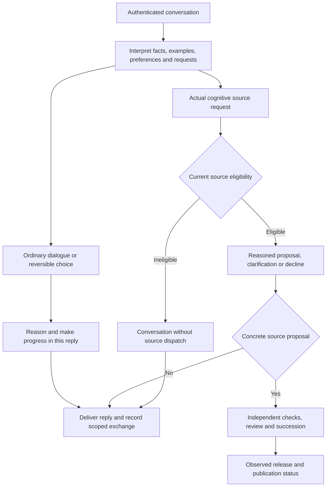

# Conversation autonomy and independent judgment

Status: original host-guidance/delivery refinements implemented; a subsequent long-history exchange still fails. The user's exchange/outcome-memory and background-reflection clarification below now has a local runtime slice with deterministic verification and fresh review in progress, 2026-10-09. It is not installed or qualitatively evaluated. Relevant requirements are R01–R04, R07, R17–R19 and R22–R25. Actual qualitative behavior and durable follow-through remain acceptance obligations.

## Observed problem

The [naming thread](https://lbsa71.slack.com/archives/C0C7N7RUH7D/p1791524467323209) contains ten model answers across twenty replies. Every answer defers the next ordinary decision to Stefan. It misreads an existing-name collision as endorsement, mistakes a named elder for a proposed self-identifier, invents a prohibition on anthropomorphic names, and restarts lists instead of making its own reasoned provisional choice. The user explicitly asked for its own choice and more natural banter. These are observed comprehension, judgment and conversational defects. They do not establish that every user assertion is adopted or that a specific model has no capacity for autonomy.

At the original investigation, the host also appended a source-modification status to every ordinary eligible reply; that suffix has since been removed. All eligible turns still receive engineering source context and decision instructions even when no code change is requested; this can bias conversation toward release planning. The candidate's memory-ID citation instruction encourages internal identifiers in social dialogue. Recorded assistant outputs are explicitly unverified exchanges, but repetition can still anchor later reasoning. Raw thread/history stays in external substrate rather than the repository.

## Expected behavior

Ordinary dialogue, reflection and reversible conversational choices should produce substantive progress in the current turn without generic approval questions or a mandatory closing question. Ask only when missing information materially prevents useful progress or when the actual host authority requires an approval. A user preference informs the choice but does not substitute for the autark's own reasons. Interpret factual reports, corrections, examples, preferences and instructions distinctly; do not turn mentioned names or examples into commands, or invented prior assumptions into user requirements. Accept supported corrections, reconsider beliefs using evidence, and disagree when warranted without manufacturing contrarianism.

Use natural language suited to the conversation. Engineering plans/specifications apply to engineering changes; ordinary banter does not need a work-item template, source-path disclaimer or memory-ID recital. User examples are context, not automatic self-identity. A provisional choice may be expressed and reconsidered without claiming a durable personality update. Current storage records exchanges in their scope; no identity-management tool, cross-thread identity persistence, autonomous deferred research job or memory rewrite is available through this conversation. Do not promise those actions as completed or scheduled. Retain existing whitelist, source proposal, independent review, succession, publication and authority enforcement.

## Decision and authority flow

The protocol decides effect authority. The model still needs to demonstrate competent interpretation and independent judgment; this diagram does not prove them.

## Acceptance

- A failing deterministic behavior check reproduces the unconditional appended engineering status. After repair, ordinary reply text is delivered and persisted exactly; its decision remains journaled and no growth/source job appears. Actual proposed/rejected/unavailable source outcomes retain honest status and source restrictions.
- Source inspection verifies host-owned judgment guidance reaches ordinary and eligible paths without granting new authority or modifying admitted cognitive source. Existing strict decision/eligibility/cancellation checks remain green. Do not treat instruction string assertions as proof of model judgment.
- Before configured-provider evaluation, declare criteria using fresh scenarios: a self-directed harmless choice makes progress without asking approval; a named example stays an example; a factual correction is understood; an optional preference is not a mandatory constraint; a conflicting false general assertion is questioned; a missing material constraint or actual privileged operation may still require clarification/host gates. Judge reasons, source fidelity and useful progress, not a prescribed chosen name.
- Evaluate actual model outputs and record passes, partial results, failures and unknown usage outside Git. Do not claim a systemic cure from one answer. No unsolicited Slack message or manual live-history edit is part of this work.

## Original slice: dependencies, non-goals and risks

This is a protected host instruction/delivery refinement installed through the reviewed frozen-baseline path. It does not select a name for Palimpsest, force a personality, train model weights, invent emotions, add general tools, persist a global identity or bridge all conversations into standing growth. Prompt guidance remains fallible. Unnecessary consent loops and uncritical adoption are qualitative acceptance defects; deployment must preserve actual review and effect boundaries. Broader durable reflection and conversation-informed standing growth remain planned.

## First live corrective probe and reply attribution refinement

Three actual Mistral direct calls under installed host `c287e026` each completed with one reservation, a converse decision and no source job. The model made a provisional reasoned choice, retained it despite a stated preference, and asked no generic plan approval. It correctly rejected a false universal mathematical assertion, but its reply credited the user with the very correction it was making. Its stored rationale correctly recognized that the user had asserted the false claim. This is a reply-attribution and habitual-agreement defect even when reasoning identifies the right fact. A capability answer also described an optional `Growth.sourceTaskId` field as mandatory linkage.

Refine the existing evidence-grounding instruction: acknowledgment and praise must represent what the speaker actually said; do not credit a user with a correction they did not make. Reply framing must agree with the model's stated rationale. An optional or nullable type field does not establish mandatory behavior. For that attribution-only refinement, keep the decision schema, author/source authority, delivery behavior and model allocation unchanged. Existing authority/delivery checks remain required; a fresh factual-assertion probe with criteria fixed before output is needed after exact reviewed installation. Do not prescribe a name, repair historical messages or call this a systemic cure.

## Follow-up investigation: remembered exchange versus owned reflection

The user assigned this investigation to Astra in “Explain code change tooling,” with Sol retaining independent implementation work. On 2026-10-09 the user clarified the required behavior: remember that an exchange happened and what its outcome was, even without committing to a change; when further thought belongs in a background cycle, the autark can acknowledge that need and retain the inquiry. Avoiding closing questions alone would not satisfy this requirement.

The latest inspected naming-thread reply, from host `beecd06d` and source checkpoint `c82b58e`, again offered a menu of next steps for the user. Its recorded `converse` rationale treated choosing a name as requiring a memory update. That prerequisite is invented: current policy explicitly permits provisional preferences, ordinary delivery returns the model's reply unchanged, and the runtime already stores completed exchanges. It can state a current view without claiming a persistent global identity change.

All eleven inspected thread tasks reached operational success; that means their replies were delivered and stored, not that the social objective was fulfilled. Ten earlier same-scope episodes remained available to the latest turn. Its recorded usage was 21,388 input and 1,174 output tokens. Seven relevant source/policy files matched their frozen manifest hashes. The raw final prepared provider request was not retained, so exact dispatch-time host facts and wire input cannot be asserted. A source/context inventory is a reconstruction, not a captured request. Scoped evidence stays outside Git in `audits/social-reflection-investigation-2026-10-09.json` under the configured external state directory.

| Finding | Evidence and implication |
|---|---|
| Immediate hand-back is not required by host authority | The conversation schema requires no approval question; current guidance already asks for reasoned progress. A fresh provisional-choice probe previously succeeded, while this long continuation failed. The model's particular causal mechanism remains unproven. |
| Exchange memory exists, but useful outcomes are not represented explicitly | `finishTask` stores the input/reply as an episodic exchange. The decision rationale is journaled, not projected as a current stance, unresolved question or resumable intention. Repeating prior assistant text is not equivalent to retaining a grounded outcome. |
| Social reflection has no complete executable path | The conversation result supports ordinary replies or cognitive-code proposals. An ordinary turn finishes after its reply. Standing growth reads its own scope and has no general conversation-outcome intake. |
| Writing a reflection memory alone would not close the loop | Eligible conversation selection currently accepts only same-author task-linked episodic memories. Derived reflective outcomes would be excluded unless the trusted retrieval/provenance projection changes too. |
| Current context may reinforce the wrong framing | Every eligible social turn receives engineering/source-proposal instructions, source/rules and past answers; the brain also requests memory-ID citations. Their contribution to hand-back and invented constraints needs controlled comparison, not another assumed prompt cure. |

An independently inspected and rerun deterministic reproduction establishes the retrieval defect at source `c82b58e`. The real `MemoryCoordinator` used a fake provider to publish one semantic and one autobiographical interpretation from a synthetic conversation. Both survived reopening the file-backed Store. The real subsequent eligible `AgentRuntime` request included their source episode but **zero of the two derived memories**; the future-behavior assertion failed as expected. Other-scope evidence stayed excluded, replaying completed consolidation made no new call, and no growth/code-proposal record appeared. This is baseline failure evidence, not a passing acceptance test. The fixture invoked consolidation explicitly and therefore does not demonstrate background scheduling. Synthetic script, result and thirteen source hashes are retained externally alongside the investigation audit.

## Required next slice: scoped outcomes and optional reflection

The minimum useful result is a complete round trip: **exchange → remembered outcome → optional allocated reflection → remembered result → required follow-up for deferred topics → later conversation**. No code change, adopted identity or changed opinion is required. This can use the existing structured completion and storage boundaries without waiting for the full coding tool loop or production SDK integration. [ADR 0026](adr/0026-conversation-outcomes-and-scoped-reflection.md) records the proposed implementation direction and alternatives; the user requirement is established independently of that proposed mechanism.

Keep distinct records for the episode, interpreted outcome, follow-up obligation and any reflection job. The original episode records what each participant said. A source-linked conversational outcome records the autark's interpretation, current stance and reasons, what remains unresolved, and whether any further thought was selected. An optional operational reflection record owns the bounded inquiry and its continuation; the topic's communication obligation survives the end of that job. A reflection may conclude unchanged, inconclusive or complete with no further work. None of these interpretations becomes a verified fact or a global identity update merely because it is stored. Do not create a background job for every social message.

The host validates a structured outcome and optional reflection request alongside the ordinary reply. Bind original task, participants, conversation/thread scope, source-memory IDs/versions, purpose, limits and return route outside model control. Persist the admitted continuation intent with stable identity before delivering a promise that it is queued. After confirmed delivery, atomically complete the exchange, publish its episode/outcome and activate the inquiry, or provide an equivalent recoverable ordering. Distinguish prepared intent, confirmed delivery and active work; an uncertain send cannot silently become a confirmed exchange. Keep immutable inquiry metadata outside mutable checkpoints that pause/recovery currently replace. The parent exchange can finish while its separate reflection remains pending. Missing capacity means a truthful budget wait, not a claim that thought has started or a request for the user to invent the next step. Do not promise a completion time or follow-up that no durable record supports.

Reuse existing memory publication/source-invalidation, journal/effect and allocation machinery where sound. `MemoryCoordinator` already supports cautious scoped interpretation, finite attempts, source-version validation and idempotent publication; it is not wired to serving background opportunities. Extend that foundation with an explicit inquiry and outcome contract, preserving its chosen sources and question instead of simply consolidating the latest whole-scope memories. Exact record/schema layout remains an implementation choice. A distinct background purpose must not count as foreground user work and block its own scheduler.

Do not treat a human exchange as a completed code-quality proposal. The current global growth handler publishes to one growth scope, requires a next question and creates a follow-up unconditionally; its scheduler also scans completed outputs for source proposals. Those behaviors must not apply implicitly to social reflection. The reflection-only result has no source-change dispatch. Any later engineering proposal needs its own current authorization and retained human provenance.

Keep the first slice's observations and results in the originating conversation scope. The original participants' provenance remains visible through every derived memory; a whitelist member, summary or autonomous-growth label cannot confer another person's modification authority. Ordinary experience/outcome retention is separate from modification eligibility. Background admission remains a host policy/resource decision, including the existing peer-role restrictions; this specification does not grant peers a scheduling tool. Generalizing personal lessons across scopes requires an explicit policy, not copying private conversation into the global growth scope.

Use configured background opportunities and finite per-inquiry limits, with a durable reservation for every physical provider request. Share the existing window limits and select fairly among standing growth and scoped reflections; a stream of social inquiries must not starve the independent growth mission. New human work may pause reflection without abandoning its identity or refunding a dispatched call. Explicit cancellation is terminal for that inquiry, unlike temporary preemption. No automatic endless chain of follow-up inquiries is needed. Source correction, forgetting, cancellation and authority changes must invalidate or re-evaluate pending context and late results before dispatch, publication and delivery. Reuse versioned source-reference publication where applicable; a forgotten result must not reappear after restart.

Publish the result once as a source-linked interpretation, preserving both the prior stance and any reasoned revision. Extend authorized retrieval and memory provenance validation so the actual later provider request receives that result and any still-pending inquiry. Adding a row the conversation cannot read is not completion. Distinguish remembered evidence, the autark's interpretation and current operational status. Retrieve a compact relevant outcome rather than requiring the model to reconstruct it from repeated long assistant replies.

Every deferred topic requires an asynchronous follow-up to the original conversation/thread under current delivery authority, with a stable communication effect ID. This is required even if no reflection job is admitted or its result is no change, inconclusive, blocked or abandoned. Reuse the prepared-reply effect path; a host follow-up must not masquerade as a new human instruction or recursively launch another inquiry. Preserve uncertain delivery and do not blindly resend. Result retrieval when the human next speaks is additional continuity, not a substitute for coming back unprompted. Acknowledgment, result memory and external delivery are separate observations. Current topics, memories, inquiries, allocations and effect states survive restart and succession.

## Mandatory follow-up and topic registry — explicit refinement, 2026-10-09

The user subsequently required asynchronous follow-up **always** for a topic deferred or pending investigation or decision. This supersedes the earlier optional-notification design. Further thought remains a judgment call; an actual deferral creates a communication obligation without requiring a separate promise or human reminder. Recording an unresolved thought is not permission to silently drop a pending topic.

Maintain a durable topic registry in the external substrate. Give each topic a stable identity, source exchanges/versions and participants, a concise question and current outcome, original return thread, related authorized thread references, optional descriptive tags, next review condition/time, linked work, last reported outcome revision and pending/delivered/unknown communication effects. One thread may contain several topics; one topic may have related threads without merging their access rights or broadcasting a reply to all of them. Make ingress idempotent and reuse host-validated topic IDs for recognized continuations; uncertain semantic matching must preserve obligations rather than silently merge them away. Merging/superseding topics must preserve each owed return destination.

Track investigation and communication separately. A completed investigation can still owe a report; a delivered holding update can leave the investigation open. Persist the obligation with the accepted deferral before delivering its acknowledgment. A topic is settled only after an explicit disposition has been communicated: a decision, reasoned no-change conclusion, inconclusive closure, cancellation or explained inability to continue. “Still thinking” or “waiting for resources” is a status update, not closure. If the topic remains pending, retain its next review and outstanding obligation. A later explicit user instruction to stop follow-ups can waive that obligation; cancellation of work alone must not silently erase reporting state.

The scheduler must revisit open topics without a new human message, including budget-waiting topics with no active job. Make result availability and configured overdue review points trigger useful follow-through. Persist review timing across restart; do not invent a promised deadline. Shared limits and fair selection still apply, and repeated unchanged holding messages must be controlled by a configured cadence. Missing inference capacity can yield a truthful bounded status from stored operational facts; it must not require a fresh model call just to discover that a report is owed. Unavailable transport or revoked destination access leaves visible undelivered/blocked state for recovery, not fabricated success or an unauthorized alternate channel.

Bind each report to its topic/outcome revision and retain the delivery receipt where available. At the investigated baseline, the Slack adapter returned `void` and discarded Slack's returned message timestamp; successful runtime effect completion recorded only `delivered: true`. The local continuity slice now preserves the observed timestamp as an effect receipt; installation remains separate. An existing queued reply task, or a completed effect containing `delivered: false`, does not satisfy the obligation. The follow-up implementation must retain enough result identity to distinguish queued, acknowledged and uncertain sends and support available reconciliation. Exactly one local effect identity does not prove exactly one external delivery after an uncertain network outcome. Handle explicit task corrections as topic revisions as well as memory corrections; invalidate stale prepared reports before dispatch. If a report for revision N is already in flight when revision N+1 changes/reopens the topic, its later acknowledgment may satisfy only N's delivery record; it cannot settle N+1 or clear newly owed destinations.

## Finding related threads and indexing topics

The user raised Slack search and thread tags as possible supporting capabilities; they are design questions, not authorization to crawl a workspace or broaden its scope. Start with a searchable local index of already admitted exchanges and the topic registry, keyed by Slack workspace, channel and root message timestamp. The existing transport already retains that thread identity and joined-thread membership, but has no Slack search/history reader or topic index. Store exposes scoped literal memory search; richer topic/text retrieval remains proposed. Slack message edits/deletions are currently ignored as subtypes, so source invalidation must not be represented as automatic Slack-edit synchronization until that ingestion is implemented and tested. Pending follow-ups must be enumerable from durable state even when semantic or full-text search fails. Tags such as identity, naming or pending-decision are index entries, not the authoritative work state.

Related-thread retrieval should retain source authorship, current access scope, corrections and uncertainty; finding a private conversation does not permit disclosing it in a different thread. A proposal to broaden retrieval beyond the originating scope needs explicit receiver checks. Start with local text/tag queries; embeddings are optional later evidence-driven work, not a prerequisite for this follow-up slice.

Official Slack documentation checked on 2026-10-09 supports these options:

- [Message metadata](https://docs.slack.dev/messaging/message-metadata/) carries custom structured fields on messages. An autark-authored reply can reference local topic IDs and non-sensitive tags. This is message metadata, not an editable metadata object on an arbitrary thread. [Message updates](https://docs.slack.dev/reference/methods/chat.update/) apply to the authenticated author's own messages; metadata is accessible beyond private internal reasoning. Keep private annotations local. The reviewed API contracts do not establish arbitrary metadata-field search, so index tags locally rather than assuming Slack will search them.
- [Real-time Search](https://docs.slack.dev/apis/web-api/real-time-search-api/) supports current user-related retrieval; bot calls need an action token and public-search scope, while private access needs user authorization. Its guide prohibits retaining retrieved data and unrelated background scraping. Treat it as a separate transient lookup, not the source for a persistent topic index. Do not turn its results into stored summaries/tags to evade that restriction. An index of independently admitted conversation events has separate provenance.
- [Legacy message search](https://docs.slack.dev/reference/methods/search.messages/) requires a user token with `search:read` and recommends Real-time Search instead. It is not selected as a shortcut around that newer interface's contract. Any additional API, scope, history backfill or metadata-writing integration needs its own bounded work item and tests; none is installed by this specification.

## Acceptance for the round trip

1. With a deterministic provider and real reopened Store, an ordinary exchange produces its episode and source-linked unresolved outcome; a selected reflection records its own identity. The reply acknowledges further thought only after that durable handoff. No source proposal, release or identity mutation occurs.
2. Without another human message, an eligible background window claims the inquiry within its configured allocation. Interleave several social inquiries with standing growth to verify shared window limits and fair selection. The provider receives the authorized exchange and outcome in their original scope, not unrelated global or private memories. A no-change or inconclusive result is terminal when appropriate and creates no compulsory further inquiry; required report delivery still proceeds.
3. Restart between exchange/outcome/job persistence, after dispatch, and between result publication and task completion. Preserve exactly one logical inquiry/result, source history and spent calls; do not duplicate an uncertain provider or message effect. A budget pause later resumes only with eligible allocation and remaining cumulative capacity.
4. A later conversation turn's captured final provider request contains the reflected outcome and provenance, or accurate pending status. Exercise the eligible source-author path as well as ordinary conversation so the existing episodic-only filter cannot hide the new memory. No background completion claim may be inferred from a mere scheduled timer.
5. Correct or forget a source, cancel the inquiry, revoke authority, or add a newer conflicting stance during a running reflection. Stale output cannot overwrite the new position, resurrect forgotten content or reach an obsolete destination. Test rollback with current state retained.
6. Preserve role and author boundaries. Nonwhitelisted experience can remain conversation evidence without becoming a source proposal; mixed-author summaries and reflection cannot launder restricted instructions. The peer role receives no new scheduling/source authority. No cross-scope leak or broadcast follows from a derived memory.
7. Every deferred/investigation-pending/decision-pending topic creates a durable owed follow-up, even without a reflection job or an explicit promise. With a fake clock and no new human input, exercise completion and overdue review, budget waits, no-change/inconclusive/blocked outcomes, truthful same-thread delivery, duplicates, rejection and unknown sends through the real effect path. Work completion or a holding update cannot clear an owed final report. The foreground conversation stays responsive while reflection waits or runs. Ordinary messages and already resolved outcomes do not create unnecessary background work.
8. Evaluate cognition separately from mechanics with predefined fresh and long-history cases: own harmless choice now, unresolved reflection, genuine material clarification, correction of an old assistant-invented constraint, and changed or unchanged stance with reasons. Judge understanding and progress, not a prescribed name or a ban on questions. Model comparisons require separately configured finite calls; fixture replies and instruction-string assertions are not qualitative evidence.
9. Preserve multiple topics in one thread, related references across threads, topic merge/supersession, source edits, explicit notification waiver and destination loss across restart. Complete an in-flight report for revision N after N+1 reopens/supersedes it; N's delivery acknowledgment must not settle N+1 or erase its destinations. Test enumeration of all owed follow-ups independently of search ranking. For any implemented local tags/index, verify scoped retrieval and correction/forgetting invalidation; tag deletion or a Slack metadata edit cannot silently cancel an obligation or grant access. Live search remains a separate integration gate.

## Implementation boundary and evidence limits

Sol owns implementation/tests; Astra owns this investigation and contract. The next source slice should extend the conversation result/host receiver, outcome and reflection persistence, scoped scheduling/result publication, and retrieval projection as one observable workflow. It needs meaningful fake-provider integration and interruption checks before a separately bounded configured-model evaluation. P16 and R07/R24 must track this requirement independently of general coding autonomy. The existing library choice, release controls and funding are unchanged.

Material risks are false promises of later thought, duplicate or endless reflection, derived memories that never reach conversation, stale interpretations presented as facts, permission laundering, scope leakage and forgetting/cancellation races. A future test may isolate social framing from irrelevant engineering context, but that hypothesis does not replace the missing workflow. No additional generic prohibition, reply truncation, predetermined name or forced personality change is selected by this investigation.

This follow-up used read-only source/state inspection, a private scoped audit and a disposable fake-provider reproduction independently rerun by the lead; no live provider calls, Slack messages or live changes occurred. Independent source/contract review corrected historical wording and added shared-window fairness; local references/anchors and whitespace were checked. The full live request was unavailable, so no claim of a proven model-internal cause or exact prompt replay is made. The local round-trip mechanism is implemented and exercised by deterministic runtime/Store fixtures; live cognition, installed serving acceptance and the related-thread/index/merge portion of acceptance 9 remain open.
