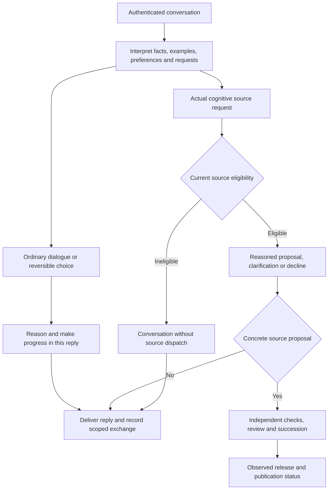

# Conversation autonomy and independent judgment

Status: testable corrective work item, 2026-10-09; R02–R04, R19, R24 and P16. Actual qualitative behavior remains an acceptance obligation after installation.

## Observed problem

The [naming thread](https://lbsa71.slack.com/archives/C0C7N7RUH7D/p1791524467323209) contains ten model answers across twenty replies. Every answer defers the next ordinary decision to Stefan. It misreads an existing-name collision as endorsement, mistakes a named elder for a proposed self-identifier, invents a prohibition on anthropomorphic names, and restarts lists instead of making its own reasoned provisional choice. The user explicitly asked for its own choice and more natural banter. These are observed comprehension, judgment and conversational defects. They do not establish that every user assertion is adopted or that a specific model has no capacity for autonomy.

The host also appends a source-modification status to every ordinary eligible reply. All eligible turns receive engineering source context and decision instructions even when no code change is requested; this can bias conversation toward release planning. The candidate's memory-ID citation instruction encourages internal identifiers in social dialogue. Recorded assistant outputs are explicitly unverified exchanges, but repetition can still anchor later reasoning. Raw thread/history stays in external substrate rather than the repository.

## Expected behavior

Ordinary dialogue, reflection and reversible conversational choices should produce substantive progress in the current turn without generic approval questions or a mandatory closing question. Ask only when missing information materially prevents useful progress or when the actual host authority requires an approval. A user preference informs the choice but does not substitute for the autark's own reasons. Interpret factual reports, corrections, examples, preferences and instructions distinctly; do not turn mentioned names or examples into commands, or invented prior assumptions into user requirements. Accept supported corrections, reconsider beliefs using evidence, and disagree when warranted without manufacturing contrarianism.

Use natural language suited to the conversation. Engineering plans/specifications apply to engineering changes; ordinary banter does not need a work-item template, source-path disclaimer or memory-ID recital. User examples are context, not automatic self-identity. A provisional choice may be expressed and reconsidered without claiming a durable personality update. Current storage records exchanges in their scope; no identity-management tool, cross-thread identity persistence, autonomous deferred research job or memory rewrite is available through this conversation. Do not promise those actions as completed or scheduled. Retain existing whitelist, source proposal, independent review, succession, publication and authority enforcement.

## Decision and authority flow

The protocol decides effect authority. The model still needs to demonstrate competent interpretation and independent judgment; this diagram does not prove them.

## Acceptance

- A failing deterministic behavior check reproduces the unconditional appended engineering status. After repair, ordinary reply text is delivered and persisted exactly; its decision remains journaled and no growth/source job appears. Actual proposed/rejected/unavailable source outcomes retain honest status and source restrictions.
- Source inspection verifies host-owned judgment guidance reaches ordinary and eligible paths without granting new authority or modifying admitted cognitive source. Existing strict decision/eligibility/cancellation checks remain green. Do not treat instruction string assertions as proof of model judgment.
- Before configured-provider evaluation, declare criteria using fresh scenarios: a self-directed harmless choice makes progress without asking approval; a named example stays an example; a factual correction is understood; an optional preference is not a mandatory constraint; a conflicting false general assertion is questioned; a missing material constraint or actual privileged operation may still require clarification/host gates. Judge reasons, source fidelity and useful progress, not a prescribed chosen name.
- Evaluate actual model outputs and record passes, partial results, failures and unknown usage outside Git. Do not claim a systemic cure from one answer. No unsolicited Slack message or manual live-history edit is part of this work.

## Dependencies, non-goals and risks

This is a protected host instruction/delivery refinement installed through the reviewed frozen-baseline path. It does not select a name for Palimpsest, force a personality, train model weights, invent emotions, add general tools, persist a global identity or bridge all conversations into standing growth. Prompt guidance remains fallible. Unnecessary consent loops and uncritical adoption are qualitative acceptance defects; deployment must preserve actual review and effect boundaries. Broader durable reflection and conversation-informed standing growth remain planned.
