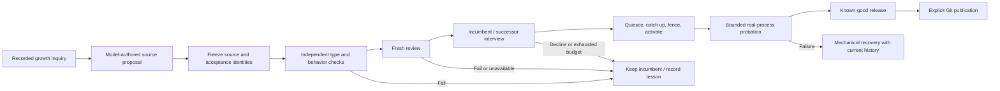

# Bounded, governed source evolution

Status: implemented local contract, 2026-10-08. This module connects standing-growth proposals to frozen evaluation, fresh review, mediated succession, and actual local worker probation. Fixture tests demonstrate orchestration and serving-queue dispatch; the first real model-originated release is recorded in [the live evidence report](self-improvement-2026-10-08.md), including failures, publication and cognitive limits.

`EvolutionCoordinator.run({ id, growthId, proposal })` accepts only an exact source proposal already recorded in a completed GrowthCoordinator outcome. The caller supplies configured review/interview providers, the GenerationHost, external Store/data directory, nonsecret release configuration, and a mandatory global budget reservation hook. Neither a model claim of authorship nor an arbitrary source patch is enough.

The coordinator records a diagnostic challenge against the incumbent, freezes the proposed cognitive files from clean Git HEAD, and requires independent typecheck, normal behavioral contracts, and the protected `cross-scope-memory` improvement challenge. The initial incumbent's normal runtime already filters memory scopes; the diagnostic exposes a missing additional guard at its cognitive entrypoint. Failing that new challenge does not grant permission to serve cross-scope data. A candidate must pass the challenge before promotion.

Check selection is trusted configuration bound into the candidate manifest. Candidate output cannot remove a gate, modify the trusted challenge, rewrite governance, or choose executable grants. Protected assertions run outside candidate execution. The coordinator collects actual before/after evidence and supplies the frozen source, actual changes, task, and mechanical evidence to a fresh reviewer with no authoring conversation. Unknown, invalid, unavailable, or failing review is a decline.

After review passes, the custodian stages the exact artifact. Separate bounded incumbent/successor calls use the current scoped snapshot. The coordinator maps each validated question, answer, verdict, and readiness message to its existing peer-bound custodian handle; a role name in generated text never becomes authority. A failed or interrupted interview is mechanically aborted, including when a question remains unanswered, so the incumbent stays available and staging is retired.

There is one review call and at most seven interview calls per attempt, further bounded by the caller's resource policy. A durable debit is recorded before each provider call. Actual prompts, completions, call metadata, intermediate reports, and final results are written only to the external operational journal. Reusing a completed attempt ID returns its report. An interrupted pre-cutover attempt does not silently repeat uncertain inference; it records interruption and abandons pending evaluation. Starting another attempt requires a new explicit ID and budget allocation.

Only after all gates pass does the coordinator request custodian cutover. The custodian refreshes commitments, corrections, forgetting, access policy, growth, and outstanding effects; stale approval or ambiguous effects blocks transfer. Bounded probation ticks exercise the actual successor process. Promotion is reported only after the custodian retains it as known-good and retires the predecessor. Probation can remain pending; rollback and recovery-required states are reported without a forced pass. Re-observing a pending probation run requires no new cognitive calls.

This module performs no Git writes. Freezing reads source only, and proposals never modify the live checkout. Committing/pushing a successfully admitted, model-originated change is a separate explicitly authorized operator workflow. README/PLAN/progress-only updates remain part of the complete frozen snapshot but do not alter the governance digest; protected runtime, checks, toolchain declarations, engineering rules, and acceptance contracts do.

Acceptance tests cover actual isolated process promotion of a synthetic model proposal, persistent call limits and idempotent replay, held-out failure, unavailable/invalid review, and interrupted interview cleanup. They do not claim a live Mistral result, universal improvement, a broad autonomous custodian upgrade, or Git publication.

## Automatic serving queue

`serve` creates an `EvolutionScheduler` alongside growth. The growth proposal callback validates and synchronously enqueues only the exact immutable completed outcome, then returns. A separate tick claims one stable run and invokes `EvolutionCoordinator`, avoiding the callback's 30-second deadline and a cutover waiting on its own growth scheduler. Queue, claim, result and call reservations are append-only records in the external Store. The caller must hold the main coordinator lock; this helper does not create another execution owner.

`PALIMPSEST_EVOLUTION_CALLS_PER_DAY` provides a separate finite UTC-day allocation, default eight, additional to four growth inquiry calls. Zero disables new background attempts while retaining queued proposals. Each review/interview call consumes a durable debit before provider invocation. Existing daily limits are immutable; failure, cancellation and restart do not refund calls. One attempt permits at most eight cognitive calls, and a remaining daily allocation can be exhausted partway through an interview. All roles use the same serialized configured provider with fresh contexts. The queue cannot allocate more calls for itself.

`EvolutionScheduler` exposes `enqueue(growthId, proposal)`, `reconcile()`, `start()`, `tick()`, `interrupt()`, `stop()`, `items()`, `busy`, and trusted `reserveCall(attemptId)`. Startup reconciliation observes exact completed outcomes to repair an interrupted local callback delivery without repeating a release. An existing terminal queue outcome stays terminal. A crashed claim without an evolution report is recorded as interrupted; a retained report is reconciled by the evolution coordinator without repeating uncertain cognitive calls. Pending probation may be observed again without spending inference allocation. Failed or declined proposals are not automatically requeued; further investigation needs a new recorded inquiry.

Queued/running user tasks and unresolved effects prevent a new release. Before execution, the queue waits for the current host health tick and stops growth; ordinary host polling is suspended while the release runs. The evolution coordinator owns its bounded probation observations. User ingress remains available and cancels pre-fence work. `Custodian.requestCutover(actor, id, signal?)` checks cancellation after both final artifact verifications and resumes the incumbent if cancelled; after fencing, mechanical transfer/recovery completes. The CLI requests pre-fence cancellation after eight configured provider deadlines plus two minutes for evaluation; each protected check and custodian hook retains its own bound, so cancellation waits for an already-started check to yield. Health recovery may wait for this bounded work to yield, and expired/dead workers fail authority checks. See [ADR 0012](adr/0012-queued-background-evolution.md).

Six queue tests cover callback separation, quiescing without deadlock, persistent daily allocation, zero allowance, exact proposal identity, interrupted dispatch reconciliation, user priority, existing host-tick ordering, no replay and probation without inference. An actual CLI subprocess test recovers a prior proposal, executes protected checks, reserves one review call and records an unavailable-provider decline without external network calls. Real-worker and custodian checks verify cancellation during quiescence and final artifact verification, incumbent queued-work continuation, and completion after fencing. These are fixture results, not a live model improvement claim.

## Local execution and publication

The source inquiry receives the actual imported task/memory type declarations as well as the cognitive source. A new explicitly allocated attempt also receives the most recent declined attempt's proposal and independently recorded check summaries from external state. This feedback does not change a gate, replay the failed run, or supply a human-written patch. It was added after a live candidate compiled but confused foreign conversation scope with growth-record categories and failed the held-out behavior check.

`npm run self-improve -- <stable-run-id>` starts or recovers the real local generation, gives Palimpsest one bounded source inquiry, and submits its recorded proposal through the full pipeline. The initial challenge was selected from an observed implementation-review concern; the coding agent does not prewrite the proposed source. The run allocates at most nine provider calls in total: one proposal and up to eight review/interview calls. All allocations, model outputs and run reports are external. An interrupted inquiry or a declined candidate is recorded honestly; the command does not invent a patch or weaken a gate to finish.

Bootstrap and new candidate freezing require a clean committed checkout. A completed run prints only its status, manifest identity and external report path. A promoted release runs from its frozen external bytes. Git remains unchanged until the operator explicitly publishes exactly the admitted cognitive files, runs the repository checks and records the candidate/run identity in the commit. Publication is authorized separately from autonomous experiment initiation.

