# Plan-driven shedding

Status: testable specification and implementation under final verification, 2026-10-09. The strict catalog, durable executor, item-specific authoritative checks and serving integration have local automated coverage, including two real-worker fixture sheds with publication and restart. Deployment and live model-generated repeated-shed evidence remain separate gates. See [ADR 0017](adr/0017-plan-driven-shedding.md), [PLAN](../PLAN.md) and [the standing growth mission](../GROWTH.md).

## Problem and expected behavior

Standing growth asks bounded questions and records source proposals. Conversational self-modification can submit an eligible suggestion through release gates. Neither mechanism selects unfinished repository work with durable dependencies and independent evidence of the item's intended behavior. A model-authored acceptance paragraph and passing generic checks do not establish a new capability.

Palimpsest should autonomously advance a declared executable part of the implementation plan through successive Skin Shed releases. It should select eligible work, generate a bounded implementation from actual admitted source, receive authoritative behavioral feedback, and preserve unfinished work after restart or succession. An unsuccessful experiment produces evidence and a continuation, rather than a fabricated success or an endless unallocated retry. The product goal remains broader than this initial executable catalog.

## Trusted work contracts

[config/development-plan.json](../config/development-plan.json) is a versioned host-owned catalog. Version 1 declares two dependency-linked P06 work items, each with problem, expected behavior, acceptance criteria, non-goals, dependencies, permitted paths, authoritative check IDs, material risks and finite attempt budgets. Its digest binds the exact contract to proposals and evidence. Models may propose implementations or disagree with an item; they cannot insert items, rewrite dependencies, choose admission checks, expand permitted paths or increase allocations.

The initial contracts are concrete context behavior:

| Work item | Observable behavior | Authoritative item checks |
|---|---|---|
| `P06-memory-provenance` | Preserve current memory version, ordered evidence references and update time in the serialized same-conversation descriptor, alongside existing grounded fields. | `memory-provenance` |
| `P06-memory-context-budget` | Select newest eligible experiences first; emit at most 12 descriptors with content prefixes at most 4,000 characters and the entire JSON memory array at most 32,768 UTF-8 bytes; retain exact metadata for included descriptors. | `memory-provenance`, `memory-context-budget` |

The second item depends on the first. Newest means descending chronological `updatedAt`, with later input position first when times are equal. The byte bound includes JSON escaping, array delimiters, evidence and all descriptor fields. Never alter lineage to fit. A descriptor whose immutable metadata cannot fit with a nonempty grounded content prefix may be omitted, allowing later eligible descriptors to fit. Truncation must not create an isolated surrogate. These constraints affect resource usage and continuity data; they are not policy-string edits and do not, alone, establish better model judgment.

`loadDevelopmentPlan({ repositoryRoot, expectedDigest? })` reads only the fixed tracked file at the exact trusted Git checkout root. It rejects alternative catalog/path arguments, frozen candidate directories, symlink files/directories, untracked catalogs, unknown fields or schema versions, unknown identities/checks/paths, duplicate identities, missing dependencies, cycles, weakened mandatory check sets and excessive resource/text limits. It returns deeply immutable records and a canonical JSON content digest. `validateDevelopmentPlan(value)` is a pure diagnostic validator; validating model-provided JSON never makes it a runtime authority source.

Loading a tracked file does not substitute for installation/admission identity checks. The coordinator must bind this catalog to the admitted protected governance baseline and the frozen candidate. The catalog and its authoritative validators remain outside candidate modification. Changing either requires the separate host/operator upgrade contract, evaluated under previously accepted controls.

## Execution and completion state

The trusted executor owns an external durable record for catalog digest, item ID, attempt ID, selected source/release identity, proposal, provider reservations, independent checks, release outcome, publication outcome and next action. The diagram summarizes the contract; implementation states and callbacks are described below:

```mermaid
stateDiagram-v2
    [*] --> Eligible
    Eligible --> Proposing: Dependencies observed in current release; budget available
    Proposing --> Evaluating: Exact proposal persisted and frozen
    Evaluating --> Releasing: Item and baseline checks plus fresh review pass
    Releasing --> Publishing: Interview, transfer and probation succeed
    Publishing --> Complete: Exact admitted source independently observed remotely
    Proposing --> Paused: Interruption or provider/resource limit
    Evaluating --> Paused: Failed check, review or bounded dispute
    Releasing --> Paused: Decline, interruption or rollback
    Publishing --> Reconciliation: Unknown/conflicting publication
    Paused --> Eligible: New bounded allocation and retained feedback
    Reconciliation --> Complete: Same prepared commit independently observed
    Reconciliation --> Paused: Explicit safe disposition recorded
    Complete --> Eligible: Current code no longer satisfies item after rollback
```

`DevelopmentExecutor` injects narrow trusted callbacks: `readSource`, `checkCurrent`, `propose`, idempotent local `enqueue`, and independent release/publication `observe`, alongside the external Store, trusted catalog, explicit `proposalCallsPerDay`, clock and user-priority predicate. It has no provider adapter, Git writer, candidate evaluator or process authority of its own. The host integrates these existing services and retains their checks.

`development.attempt.started` atomically records an attempt and its proposal-call reservation before authoring. `development.attempt.updated` records `authoring`, `proposed`, `queued`, `paused` or `completed` state. `development.window` binds each fixed UTC day's immutable proposal allocation, shared across catalog revisions. A deeply cloned source snapshot and contract are passed to authoring; late output is discarded when the source changes, user work intervenes or explicit recovery has superseded that authoring state. The source is observed again before dispatch.

The host calls `recoverInterrupted()` only after its exclusive coordinator lock proves the old owner stopped. Construction never makes that inference. An authoring claim interrupted by death becomes paused with its uncertain call retained. A persisted proposal can complete local idempotent growth publication/enqueue without another authoring call. An already queued attempt reconciles its existing release; unknown or conflicting publication keeps it queued and prevents another source proposal. `interrupt()` aborts active authoring; `stop()` waits for it to quiesce. The host owns future ticking and shutdown.

Each plan proposal becomes an immutable completed Growth outcome, with top-level host-authored `development: { catalogDigest, itemId, attemptId }` and `sourceBinding: { version: 1, releaseDigest, sourceDigest, baseCommit }`. The untrusted `GrowthProposal` contains neither authority descriptor. The release coordinator must look up the exact durable attempt, validate its proposal/state/identity, and select checks from the trusted catalog. Item evidence binds catalog, release, source and evidence digest; it contains only catalog check IDs, while the release pipeline additionally enforces its ordinary baseline checks. Completion requires both fresh current-source checks and exact candidate release evidence, observed promotion, and matching independently observed source publication.

Choose work only when production is ready and user commitments/unresolved effects allow it. Delivery-work scheduling and standing growth share explicitly configured capacity fairly; neither may starve the other or consume an undisclosed allocation. Catalog attempt ceilings are additional limits, not grants overriding the host's daily budgets. Debit provider calls before invocation; uncertain or interrupted calls are not refunded. A pre-fence interruption checkpoints work and leaves the incumbent serving. After fencing, finish mechanical transfer/recovery before selecting another item.

Every new attempt receives the current admitted source and its exact source identity, current clean Git base, selected immutable contract, and independently recorded feedback from previous attempts. A returned proposal must bind to those identities. Reject stale source, protected paths, unrelated changes or model-supplied check selection. Do not re-run an old uncertain attempt ID as if it were a fresh invocation. Budget exhaustion preserves the next step until a later authorized window; exhausting the item's finite attempt ceiling produces an inspectable hold.

Run the ordinary mandatory release checks **and** the trusted selected item's behavior checks. Collect held-out fixtures outside candidate execution and bind evidence to the exact frozen source, catalog and item. A fresh reviewer receives the change, contract and actual evidence. Its approval cannot override failed/unavailable checks. Existing role-authenticated interview, checkpoint/catch-up, fenced cutover and probation remain mandatory. Lived tasks, memory, corrections, authority policy, growth and unfinished plan records stay outside the checkout and survive code replacement.

Reconcile exact-artifact Git publication for plan releases before preparing a subsequent shed. A promoted but unpublished successor must not be overwritten by a candidate frozen from an older checkout. Dirty source, divergent remote state, or unknown push outcome holds progression; independently observe retained operation identities before retrying. Historical completion and current capability are separate: rollback retains previous evidence and lessons but can invalidate a dependency in the current serving source.

## Acceptance and evidence

Implementation completion requires independently observed behavior, not this specification's existence:

1. A fixture seed fails the first work-item check; the admitted first candidate passes it while preserving baseline contracts. A second candidate passes the byte/resource check and retains first-item behavior. Compile-only or hard-coded fixture behavior is rejected on fresh cases.
2. With no new human assignment, actual configured Mistral generates and implements both dependency-linked items in two successive sheds. Each passes independent checks, fresh review, mediated succession and real-worker probation; exact admitted source is published and independently observed remotely. Neither source patch is supplied manually by the operator.
3. Restart between the sheds. The successor selects the unfinished eligible item using current source and durable feedback, without repeating already accepted calls/publication effects or resetting budgets.
4. Inject a failed item check and a provider interruption. The incumbent remains useful; actual failure feedback reaches the next separately allocated attempt. Cancellation, whitelist revocation and unrelated-user conversation cannot manufacture plan authority.
5. Exhaust allocation, then advance to a later eligible window. Resume the same item within immutable budgets and attempt ceilings. User work interrupts pre-fence activity promptly; post-fence transfer/recovery completes safely.
6. Exercise source mismatch, candidate mutation, publication conflict/uncertainty and rollback. No stale candidate advances or blindly replays an uncertain effect; current memory and the unfinished agenda survive.
7. Reconcile plans, specifications, operational instructions and release evidence after results. Keep private runtime journals and histories outside Git. Do not mark all P06, the full seed, or the broader self-evolution goal complete on these two context improvements.

Current local evidence: five loader tests cover contract identity/immutability, strict schema and authority rejection, dependency/cycle/size bounds, fixed tracked-checkout loading, candidate-directory exclusion and symlink rejection. Nine executor tests cover dependency-linked selection with durable reopen, exact metadata/publication completion, actual failure feedback, cooldown/attempt ceilings, immutable allocation after uncertain inference, explicit interrupted-owner recovery and late-result rejection, user priority, source mismatch, protected proposals, rollback revalidation, concurrent tick exclusion and post-inference source-collector failure. Callback fixtures do not execute a real candidate, publish Git or demonstrate a live shed. Serving integration, behavioral-validator and live release results must be recorded separately.

## Scope growth and next capability

Most PLAN items need more than `src/agent/brain.ts`. P11 interview orchestration, persistent-memory infrastructure, general tools and custodian replacement currently belong to protected host code. The executor must expose unsupported work as a concrete authority/dependency gap, rather than claiming to run the whole plan or endlessly selecting impossible tasks. Suitable application behavior can move behind candidate-owned modules with typed host-enforced effects; admission and recovery controls remain separately governed. Broader host/custodian evolution needs its own upgrade and older-rescue contract.

A proposed materially distinct next capability is P07/P16 procedure routing: a cognitive action-planning export produces a typed intent for an already admitted version of a reusable procedure; the host validates current caller/task authority, input schema, exact procedure identity and allocation, executes through the existing bounded procedure runtime, journals uncertain effects and returns an independently observed result. Fresh numeric inputs, malformed intents, wrong versions, cross-thread authority and cancellation form acceptance cases. This design is not selected or implemented by this catalog and grants no new tool authority. It would require its own specification and host-baseline installation before candidate evolution can use it.

## Code quality and configured resources

### Publication recovery after later host commits

Live startup exposed a recovery defect: an earlier exact cognitive release was pushed successfully, then a reviewed host commit advanced the same configured branch. Reconciliation required the remote tip to equal the earlier commit, so it incorrectly held all new plan work as an uncertain push.

The expected behavior is to independently observe that the fixed configured remote branch still contains the exact reserved publication commit, including when its tip is a descendant. Verify the saved commit's cognitive bytes against the frozen artifact before accepting that observation. Missing objects, unavailable remote observations, divergent history or mismatched source remain uncertain or declined; neither a local tracking ref nor a candidate assertion proves publication. Observation may fetch bounded Git objects, but cannot create another push reservation, push again, overwrite the checkout or rebase the admitted source.

Acceptance requires restart reconciliation after a later remote descendant, rejection of a divergent branch and mismatched saved source, unchanged checkout/ref and unchanged push reservation count. This depends on fixed destination identity and retained Git history. Branch history rewrites and remote unavailability can legitimately leave an unresolved hold. Protected host installation and fresh review remain separate from cognitive sheds.

### Candidate checking from the persistent host bundle

The first live plan proposal passed its provenance fixtures but failed compilation with missing Node type definitions. The immutable host bundle links the verified shared dependency directory; the compiler received the bundle's symlink path while isolation grants resolve canonical paths. The intended behavior is the same authoritative compilation from either the checkout or the copied host, using the exact trusted dependency identity and canonical granted paths. No admission check, resource allocation or isolation permission is relaxed.

Acceptance requires reproducing the failure from a relocated host with linked dependencies, passing compilation there after correction, and still rejecting genuinely malformed candidate source. Keep the original frozen release unchanged. Shared dependency/runtime availability remains an operational dependency; unavailable checks still fail closed. Host installation and independent review are required before retry. A failed authoring attempt remains spent and historical evidence remains intact.

The user explicitly requested inspection of self-authored work quality on 2026-10-09. Both authoring and fresh review instructions now cover small readable changes, descriptive names, accurate comments, preserved useful behavior, resource costs and edge cases. Memory work receives grounded hints about JSON escaping, multibyte Unicode, ordering ties, oversized immutable evidence and safe truncation. A tiny content prefix that only passes a bound is not evidence of useful context behavior. Hints describe the problem and invariants; they do not supply the candidate patch or held-out fixtures. Read [the quality inspection contract](self-evolution-quality.md).

The serving executor has a separate explicit allocation: `PALIMPSEST_PLAN_PROPOSAL_CALLS_PER_DAY` defaults to **2**, and `PALIMPSEST_PLAN_EVOLUTION_CALLS_PER_DAY` defaults to **16**. Either set to zero disables plan authoring/scheduling in `serve`; configured Git publication is also required. Each selected item still has at most one proposal call and eight release calls per attempt, and at most three attempts. Daily windows are immutable once opened and calls are reserved before inference; no existing standing-growth or interactive window is refilled. Two proposal calls do not guarantee two successful sheds. Cost remains unknown where provider usage/pricing evidence is absent.

Every candidate inherits all previously admitted check IDs, regardless of whether a human, plan item or standing growth originated it. Selected work may add checks, never remove the baseline or inherited floor. Operator host-baseline installation also preserves this floor. Recovery can restore an exact older artifact with its own contract and current lived state; current plan capabilities are then reconsidered. This preserves established behavior during forward evolution rather than spending new attempts repairing an avoidable regression.

Failure feedback carries bounded independently collected failed baseline diagnostics, including compiler output and relevant review findings, in addition to item-check results. These are untrusted evidence to diagnose a defect, not permission to alter checks. Complete private inference/release records remain outside Git.

The implementation now includes a durable executor, strict source binding, per-item frozen behavioral checks, all-origin publication reconciliation and serving integration. Focused executor/loader checks and a real-worker two-shed fixture with local remote publication and restart passed. Fresh review found inherited-check and baseline-feedback gaps; fixes and their final integrated verification are being collected. Live model-generated successive sheds and production deployment of this new executor remain pending. The existing single live conversational shed does not substitute for that evidence.
