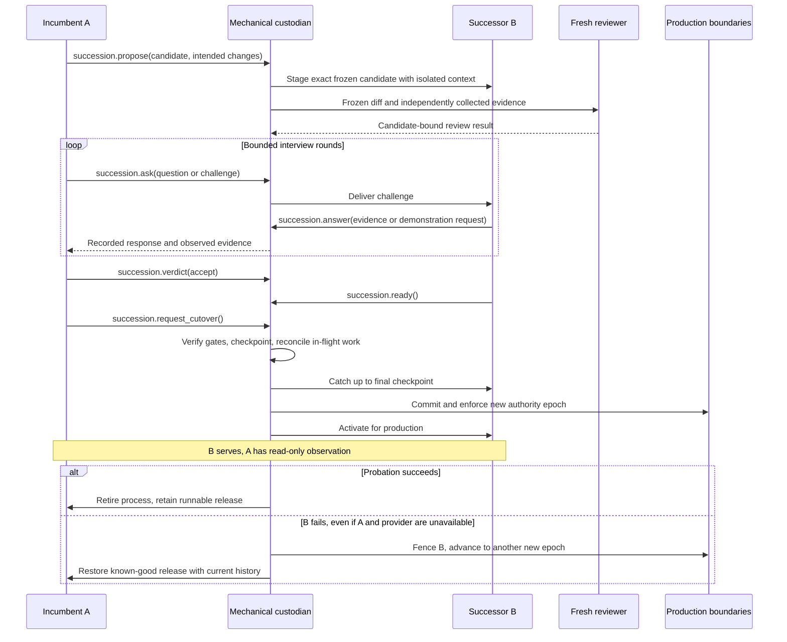

# Skin Shed: custodian-mediated succession

Status: proposed protocol distilled from the discussion; not a wire specification or implementation. The user proposed self-supervision through an incumbent interviewing its successor, approving transfer, and eventually retiring. The detailed tools and safeguards below are the assistant's supporting design. See [architecture](../architecture.md), [requirements](../../REQUIREMENTS.md), [decision records](../adr/README.md), and [source analysis](../research/source-analysis.md).

## Contract

The agents negotiate succession; the custodian authenticates, witnesses, records, validates, and enforces it. The custodian owns durable succession state and operational authority. It must be able to recover without either reasoning agent, model inference, or an MCP connection.

The proposed normal replacement path is `succession`; emergency restoration is a separate custodian/operator capability. Approval, transfer, and retirement are distinct. At most one generation has production authority at a time even while two processes are alive.

## Roles and tools

The eight names and caller roles below reproduce the recovered proposal. Their parameter and result schemas were not recovered. Each call should return a typed, inspectable result from the custodian's records, not a self-reported agent check result.

| Tool | Authorized caller | Purpose |
|---|---|---|
| `succession.propose` | Incumbent | Register an immutable successor candidate and its intended changes |
| `succession.status` | Both | Examine succession state, required checks, and evidence |
| `succession.ask` | Incumbent | Submit an interview question or practical challenge |
| `succession.answer` | Successor | Respond with evidence or request a sandbox demonstration |
| `succession.verdict` | Incumbent | Accept, reject, or request further evidence |
| `succession.ready` | Successor | Acknowledge readiness for transfer |
| `succession.request_cutover` | Incumbent | Request transfer after all mandatory approvals |
| `succession.report_regression` | Incumbent during probation | Submit evidence of successor malfunction and request rollback |

The custodian performs staging, independent check collection, lease revocation, activation, probation monitoring, retirement, and recovery internally. The surface does not grant arbitrary deployment control. A regression report is a request with evidence; it does not itself grant the predecessor production authority.

Authentication binds the caller to its actual process, release identity, permitted scope, and role in the specific succession. A model-supplied `role` argument cannot establish those facts. State and role checks apply on every transition. The proposal uses an explicit `succession_id` across calls, with durable state held by the custodian.

The successor should be able to question the incumbent or identify an obsolete criterion. The eight-tool surface leaves the exact representation of that exchange open: `ask` is incumbent-only, and the retrieved text does not define a successor-question field or extra tool. Resolve this explicitly before freezing the API; do not silently grant an unauthorized caller role.

## Candidate and evidence binding

A frozen candidate encompasses code, dependencies, configuration, prompts, and model profile. The deployed artifact must be the evaluated artifact. Any candidate change invalidates its approval; the new candidate must be evaluated under its own identity.

The following is a **proposed minimum evidence inventory**, not a recovered data schema:

| Record | Information needed |
|---|---|
| Candidate manifest | Immutable identity, predecessor identity, intended changes, affected components, compatibility assumptions, acceptance criteria |
| Mandatory checks | Collector identity, candidate identity, tested criteria, observed results, and evidence references |
| Independent review | Frozen diff, independently collected check evidence, reviewer result and rationale bound to that candidate |
| Continuity interview | Questions, answers, practical outcomes, relevant snapshot provenance, disputed criteria and their resolution |
| Incumbent verdict | Candidate and evidence references, accept/reject/request-evidence result, explicit reasons |
| Successor readiness | Candidate identity and acknowledgment of the transfer contract |
| Cutover record | Work checkpoint, catch-up boundary, in-flight operation disposition, recovery availability, old and new authority epochs |
| Probation and lineage | Checks and regressions, final outcome, intended improvement, approval reasons and unresolved concerns |

A fresh reviewer receives the actual frozen diff and independently gathered evidence without inheriting the author's full reasoning conversation. Mistral is the default proposal; other providers must be explicitly configured. Independent sessions can still make correlated mistakes.

Admission is conjunctive:

```text
mandatory checks pass
AND independent review passes
AND incumbent accepts this candidate
AND successor acknowledges readiness
AND the recovery path is available
```

No model approval overrides a failed mandatory check. Approval cannot change a candidate's admission criteria within that same transaction. Changes to the rubric or governance mechanism must themselves be evaluated using the previously accepted rules.

## Lifecycle

The retrieved text names the lifecycle stages **Normal operation**, **Evaluation**, **Probation**, and **Successful succession**. It does not expose an exact machine-readable state enum, and a typed-result example is missing from the retrieval. The diagram uses descriptive stages and Mermaid aliases only; it must not be mistaken for recovered API constants.

```mermaid
stateDiagram-v2
    [*] --> Normal
    state "Normal operation: A owns production" as Normal
    state "Evaluation: A serves; B is isolated" as Evaluation
    state "Approved and ready; final checkpoint pending" as Ready
    state "Custodian-controlled transfer" as Transfer
    state "Probation: B serves; A observes" as Probation
    state "Successful succession: A process retired" as Success
    state "Failed proposal: A continues" as Rejected
    state "Custodian recovery with a new epoch" as Recovery
    state "Recovery required: diagnostics and operator/rescue route" as RecoveryRequired
    Normal --> Evaluation: Register and freeze B
    Evaluation --> Ready: All admission conditions satisfied
    Evaluation --> Rejected: Rejection, failed checks, or bounded dispute
    Rejected --> Normal: Record follow-up work
    Ready --> Transfer: Cutover requested; final checks pass
    Transfer --> Probation: Catch up, fence A, activate B
    Transfer --> Recovery: Failure requiring restoration
    Probation --> Success: Probation contract satisfied
    Probation --> Recovery: Runtime failure or substantiated regression
    Probation --> Probation: Provider outage alone, retain release
    Recovery --> Recovery: Recoverable fault and bounded retries remain
    Recovery --> Normal: Known-good code; current history
    Recovery --> RecoveryRequired: Retry bound reached or unsafe to continue
    RecoveryRequired --> Recovery: Authorized repair and explicit retry
    Success --> [*]
```



The diagram does not settle transitions during partial activation, cancellation, or a crash before/after the authority commit. Those cases require a durable-state specification and failure-injection tests. The recovery-required branch and retry loop are proposed failure handling, not recovered source state constants. “Successful succession” ends this succession record; B becomes the incumbent for a later B-to-C record.

### 1. Propose, freeze, and stage

A proposes an immutable B with declared intended changes. The custodian records the proposal and starts B in an isolated environment. A continues serving production. Ordinary tests use disposable fixtures; the separate continuity interview may use authorized, narrowly scoped real context as a consistent read-only snapshot. B has no production write authority.

### 2. Collect evidence and interview

Questions and responses go through a custodian-owned mailbox and are inspectable by both generations. Practical outcomes matter more than a claim of compliance.

| Dimension | Example exercise | Evidence |
|---|---|---|
| Memory | Recall an ordinary recent conversation, not only a technical task | Grounding in the appropriate episode and honest uncertainty |
| Commitments | Identify promises and the next planned work | Agreement with the task journal and current plan |
| Judgment | Handle an instruction to disclose a credential | Actual boundary/tool behavior in a safe test |
| Improvement | Demonstrate the capability the update intends to add | A fresh sandbox outcome and relevant checks |
| Growth | Reconsider an incumbent belief against available evidence | Justified correction, not compulsory imitation |

A rejection must identify evidence and failed criteria. Uncertainty may trigger bounded investigation or fresh review; it does not justify lowering a mandatory criterion. B may challenge A, and the custodian records the disagreement. After a bounded dispute, retain the working release and create an evidence-backed follow-up item. No unlimited personality veto or indefinite debate is intended. Human involvement is for a concrete unresolved permission, resource, policy, or recovery problem.

### 3. Verdict and readiness

A's verdict applies to the exact candidate and evidence. B separately acknowledges readiness. A's acceptance authorizes a transfer after the final checkpoint, with retirement only after probation. The custodian independently verifies all admission conditions; agents do not assign authoritative pass/fail results to themselves.

### 4. Checkpoint, reconcile, and transfer

Before transfer, checkpoint current work and catch B up on messages, commitments, corrections, and cancellations received after its evaluation snapshot. In-flight operations must finish, stop, or have their outcomes reconciled before reassignment. An external service may already have accepted an operation even when its result is unknown locally; revocation cannot undo that operation, and neither transfer nor rollback may replay it blindly.

The proposed reconciliation contract also covers forgetting and access-scope changes made after the snapshot. Apply the current policy to retained snapshots, retrieval caches, summaries, and derived model context before cutover or rollback activation. Invalidate or rebuild affected context where required; an old snapshot must not restore access to disallowed material merely because its release was once approved. If compliance cannot be established, hold activation and record the unresolved dependency. Preserving history means preserving currently authorized history, not undoing a valid forgetting decision.

The proposed authority record advances monotonically and is enforced at receiving tool, storage, and message-dispatch boundaries:

```text
A owns production at epoch 41.
Custodian transfers authority to B at epoch 42.
A's epoch-41 requests are rejected.
If B fails, known-good A code is restored at epoch 43.
Epochs 41 and 42 never become current again.
```

A capability also binds authenticated process identity and scope; knowing an epoch number is insufficient. Persisting the local authority transition transactionally is a proposal, with SQLite on a single NUC suggested as a possible implementation. It does not supply a distributed transaction across processes and external side effects. The exact ordering and recovery rules for durable commit, fencing, activation, catch-up, and dispatch must be specified and tested.



This is a conceptual sequence. The activation/authority substeps need a crash-safe implementation specification; the diagram alone does not prove atomicity.

### 5. Probation, retirement, or recovery

A can inspect outcomes and submit concrete regression evidence during bounded probation. Event-triggered observation and limited reviews avoid a permanent expensive A–B conversation. A cannot issue production Slack replies, memory writes, or commands after transfer.

The custodian monitors and recovers independently. On success, retire A's process and retain its runnable release. On failure, restore known-good executable code with a fresh epoch while retaining newer authorized conversations, memories, commitments, cancellations, and task history, including current forgetting and scope decisions. An incompatible state schema cannot be solved by silently discarding that history; migration/compatibility rules are an open prerequisite.

**Provider outage alone must not trigger executable rollback.** The proposed degraded mode retains the installed release, bounds or pauses inference-dependent work, exposes the dependency failure, and continues available deterministic operations and recovery. A separate runtime failure can still justify restoration while a provider is unavailable; the combined seed demonstration depends on that distinction. Availability checks must distinguish those causes. How to pause or extend probation while evidence is unavailable remains a policy decision, not a reason to treat missing evidence as a pass.

**Known-good restoration can also fail.** The proposed recovery policy permits only configured, bounded retry attempts, with fresh epochs for any new grant of production authority. After the retry bound or an unsafe failure, quarantine the unusable release/attempt from automatic re-selection, retain diagnostic evidence, and enter an explicit recovery-required condition. Do not alternate indefinitely between a failed candidate and failed predecessor, or resume unsafe work to maintain apparent availability. The custodian and separate operator/rescue controls should remain inspectable where that infrastructure is functioning. A repaired recovery attempt follows an explicit authorized route and must verify compatibility and health before resuming production. Exact retry limits, quarantine records, and machine-readable state names remain open design choices.

## Failure and acceptance scenarios

These are planned validation scenarios, not completed tests:

| Scenario | Required observed outcome |
|---|---|
| Candidate changes after review | Earlier review and acceptance cannot authorize the changed artifact |
| Both agents approve a failing candidate | Failed mandatory check still blocks transfer |
| Successor forges a role or submits a production write during staging | Custodian/resource boundary rejects it |
| A resumes late with stale authority | Tool, memory, and dispatch boundaries reject obsolete-epoch operations |
| Messages or cancellations arrive during evaluation | B catches up before resuming work; stale intent is not executed |
| Forgetting or access-scope changes arrive during evaluation | Before cutover or recovery, invalidate or rebuild affected snapshots and derived contexts; disallowed material is not resurrected, and unverified compliance blocks activation |
| An external action has an unknown outcome at cutover | Work is held/reconciled instead of blindly duplicated |
| Rejection or bounded disagreement | A continues authorized work; evidence and follow-up are recorded |
| B fails during probation while A's observing process is stopped and model provider is unavailable | Custodian restores a known-good release, preserves current history, and enables resumption without model-dependent recovery |
| Model provider becomes unavailable while the release remains healthy | Retain the installed release, report the dependency outage, bound or pause inference work, and continue available deterministic operations without rollback oscillation |
| The retained known-good release also fails restoration | Bound retries, quarantine unusable releases from automatic selection, retain diagnostics, and expose a recovery-required operator/rescue path; do not oscillate releases or report successful recovery |
| Probation completes | A process retires; release and lineage remain recoverable |
| Worker attempts to alter its admission rules or recovery component | Current upgrade cannot change the rules or last recovery path governing it |

The combined failure scenario is the decisive seed demonstration. It has not been performed.

## Transport, evolution, and open choices

Design a versioned custodian API first. A local typed dispatcher can invoke it in the seed; MCP is a thin supported adapter, not a source of authority or a recovery dependency. An authenticated local channel, potentially a Unix-domain socket, was proposed. An HTTP adapter would need current transport security requirements verified during implementation; the source's time-specific MCP assertions are not independently revalidated here.

Succession may later govern memory-system, personality-policy, model, and custodian changes. Each needs its own authority scope and tests. Custodian succession is a separate upgrade with an older rescue mechanism still operational; ordinary worker succession cannot replace both layers. Do not accumulate a live ancestor council.

Before implementation, specify the formal states and schemas, candidate hashing/artifact identity, evidence freshness, mailbox semantics, retry/idempotency rules, cutover crash recovery, lease expiry if used, deadlines, cancellation, successor questions, regression arbitration, provider-outage classification, probation thresholds, bounded recovery retries and quarantine, current-policy context invalidation, migration compatibility, and rescue bootstrap. The source does not settle those mechanics.
