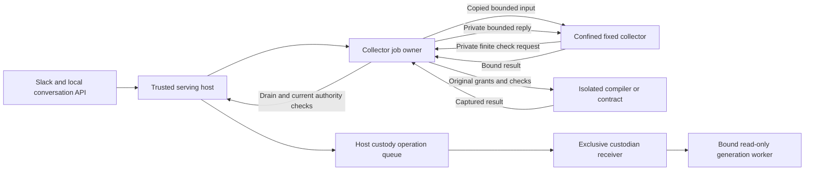

# Keep serving responsive during candidate collection

Status: source integrated/reviewed and native-installed; idle/restart acceptance passed, 2026-10-10. Final full-source rerun and destination busy-collector latency/reporting remain separate open gates. Work: P04/P05/P09/P10, R04, R09–R11, R14, R17–R19; [ADR 0024](adr/0024-serving-responsive-candidate-collection.md).

## Problem and evidence

Destination acceptance on 2026-10-10 found a separate idle-history cost after native migration: repeated journal selectors decoded unrelated large provider/checkpoint payloads while completed-task reads stalled. The [idle journal work item](work-items/idle-journal-responsiveness.md) specifies SQL-side type selection, preserved audit/replay semantics and separate offline/host acceptance. The existing collector, release checks and scheduler cadence remain unchanged. Its separate actual native gate now passes; [the migration report](migration-acceptance-2026-10-10.md) records exact source, installation/recovery, quiet reads, shutdown, cold restart and limitations. Offline measurements alone did not establish that gate.

The standard source run at `c82b58e` passed 450 checks, failed the plan-serving-policy events request with `ECONNRESET`, and skipped one unsupported-platform branch. Independent disposable replays using the original finite worker also failed twice. The CLI remained alive and exited cleanly on subsequent SIGTERM. Retained raw probes measured approximately 6.45 seconds of uninterrupted event-loop delay and an actual socket timeout/close. This is separate from the fixed 300-second cognitive-worker expiry.

`evaluateChallenge` ends with synchronous full verification; its resolved continuation immediately freezes a candidate and begins `evaluateCandidate` with another synchronous verification. The whole chain runs on the serving event loop. Freezing alone took about 2.2 seconds; offloading only that step would leave other collectors and slower snapshots blocking requests. A simple isolated stall probe passed, so the evidence does not establish that every delay alone causes a reset. The source chain, queued connection timing and actual replay jointly establish the observed defect. Private receipts and raw diagnostic files stay outside Git.

## Expected behavior and selected scope

Ordinary API/Slack handling, cancellation and mechanical supervision must remain responsive while trusted source/check collection proceeds. Run the unchanged installed candidate collector through a fixed host-owned subprocess for each challenge, freeze, evaluation or full verification operation. Keep `src/candidates.ts`, manifest semantics, historical verifier identity, check selection, runtime, dependencies, HTTP limits and release assertions unchanged in this slice.

The host selects the helper, executable and imported collector module. Requests bind a stable job ID, immutable copied options, options digest, operation, exact source/base/proposal or artifact identity, and the originating process/epoch. Production capabilities, credentials and writable custody are not inputs. The helper receives purpose-specific read/write grants, its private job directory and only the hash-bound trusted programs needed by the existing collector. The helper's ability to run Git and the protected isolation launcher must not expand the candidate check's existing fork/network/file grants. Verify nested confinement with actual subprocesses before enabling this route.

Actual macOS probes reject a second Seatbelt application inside an already confined helper with `sandbox_apply: Operation not permitted`; system logs identify `forbidden-sandbox-reinit`. A private broad Sandbox-syscall diagnostic also fails, so adding a production syscall grant is not justified. Keep the trusted collection helper confined and broker its finite checker launches through the parent. An explicit trusted operation-scoped launcher context sends the unchanged collector's bounded options over that helper's private pipe. The parent validates the exact target source, installed Node/compiler, derived read/denial grants and selected check arguments; it denies writes, forks, environment overrides, sessions and additional executables. Run the original isolated launcher in the parent, preserving its profile, stdin, finite timeout and output bounds. Candidate execution has no access to this control channel; its stdout remains captured checker data. The broker is a fixed collector interface, not a model command tool or public endpoint.

Keep phase journaling between operations. Validate bounded result shape and job/input/result identity in the parent, then recheck current source, author policy, process/epoch and expected artifact before consuming a result, reserving inference, proposing or cutting over. Full original verification stays off the serving event loop. Candidate-selected modules, paths, check policies, fallback evaluators and generic command execution are excluded. A projected or staged frozen result gains no admission authority by existing on disk.

Wire development challenges, evolution stages, custody verification and serving Git-publication verification through the same host collector. Standalone publication keeps its original verification contract; initial bootstrap occurs before the local serving API is available. Unwired staged workspace primitives do not establish serving command integration.

## Ownership, interruption and recovery

Retain one writer/job owner until actual completion and cleanup. Durably record an outer launch intent before spawn, then its actual process/group identity. Synchronous Git children inherit that group. Parent-brokered `runIsolated` checker children form separate detached groups: a trusted operation-scoped ownership context records intent before launching, actual identity immediately after spawn, and actual close plus scratch cleanup before drain. Retain actual child references in the parent, independently of helper lifetime. Cancellation or helper death cancels currently owned checker launches and waits for their actual cleanup before releasing the job. Unknown spawn gaps after parent interruption remain held. The context adds no candidate-selected grants and must not capture unrelated persistent generation sessions.

Cancellation or the finite observation deadline promptly prevents result admission and new stages. Signal known live owned check children and terminate a positively owned helper group when synchronous Git blocks cooperative cancellation. Cancellation/deadline is not evidence of drain. Preserve job/writer ownership until outer and every nested intent have proven close/cleanup. Journal or observer failure fails closed and attempts cleanup of currently owned children; it cannot erase the unresolved intent.

A crash between spawn and PID recording is deliberately unknown. Missing identity, held pipes, ambiguous identity after restart, failed cleanup or an unresolved launch leaves the job held and blocks conflicting replacement/replay. Persisted PID alone does not authorize killing an arbitrary process. Reopening must distinguish observed completion from interrupted/unknown work; it must preserve prior candidate/evidence, spent calls and uncertain effects. Automatic recovery from every unknown-process case is not established by this correction and must remain explicit in evidence. An outer helper exit or worker-thread termination alone is insufficient.

For finite launches using the existing trusted child exception, leader close must be followed by bounded observation of the currently owned ordinary process group. Terminate remaining known group members and confirm absence before scratch cleanup, drain receipt or result settlement. An unresolved observation/termination failure retains scratch and ownership. This proof covers ordinary inherited groups, not a trusted helper deliberately creating detached/new-session descendants; default candidate fork denial and persistent read-only sessions retain their existing contracts.

Mechanical generation recovery takes priority over ordinary collection. Cancel in-flight collection under its current live ownership and await settlement before collecting the retained fallback; the backend must independently require complete drain receipts before another launch. Deny new ordinary collection while custody is recovering. A healthy retained release must not exhaust its recovery attempts merely because a cancellable background check owned the collector, and held descendants must still block replacement honestly.

Ordinary collection must check the actual bound worker's availability as well as custody phase/epoch before dispatch and after awaits; stale `normal` state is insufficient. Cached diagnostics and the final pre-inference boundary obey the same live-source/current-authority contract. The trusted custody artifact-integrity hook has a separate private purpose: verify the exact requested artifact against the unchanged custody fence and retained identity even if the read-only predecessor observer has been stopped. It grants no production tool authority or new proposal admission. Public collection controls cannot select this integrity purpose, and the queued post-verifier origin validator still rejects new work from a dead worker or withdrawn author. Only actual recovery may preempt ordinary collection and collect its retained fallback. This separation preserves offline mechanical recovery and the existing stopped-observer tests.

The serving CLI must schedule mechanical health independently of evolution, development and publication work: their busy promises cannot suppress the next health opportunity. Keep the installed conversation-continuity registry's bounded, non-inference review opportunity available while those background owners are busy. Keep custody transitions exclusive, serialize background work separately and drain both owners on shutdown.

Serialize this host's custody maintenance and transitions so a healthy probe in flight cannot consume an evolution attempt by causing `transition_in_progress`. This trusted host queue covers health, proposal, exact evidence/snapshot registration, awaited interview messages, cutover, probation observation and mechanical cleanup. It grants no receiver authority and does not change direct custodian rejection rules. Copy accepted operation data before waiting and validate current worker/actor/epoch, source and origin policy inside the queued operation. Validate admission again after asynchronous artifact verification while the incumbent still holds authority, including the final predecessor check before fencing; queue-entry validation alone cannot cover withdrawal during that check. Post-cutover observation and cleanup use exact current succession state rather than the retired incumbent's authority; withdrawn suggestion policy must not prevent necessary cleanup or retained recovery. Resume an exactly bound recorded attempt for mechanical observation/no-replay cleanup before requiring authorization for new work; retain its spent call count and actual outcome. Collector, model and background-work waits stay outside the queue. Custodian hooks must not acquire it recursively. Close rejects new entries and drains existing work before closing custody.

Publication must re-evaluate the originating growth item's current source policy after asynchronous verification and immediately before each new Git mutation. Admission is retained evidence, not a continuing grant from a withdrawn author. If policy changes after preparation begins, preserve the recorded phase and any uncertain outcome; do not replay a push. Read-only observation of an already reserved push remains permitted so an external outcome can be reconciled honestly.

Reconcile an exactly bound terminal non-promoted plan result before collecting unrelated current diagnostics. Recording its decline/failure/interruption/rollback spends no new authoring call and grants no completion or release authority. A promoted plan result still requires fresh current checks and exact publication evidence before marking the item complete. Invalid or mismatched observations cannot bypass those checks.

## Acceptance criteria

1. Reproduce the existing serving reset before implementation. Run both unchanged serving-policy fixtures concurrently with their existing polling, assertions and HTTP limits; both must pass without request retries or relaxed checks. Separately measure authenticated events/API response latency while the actual collection chain runs; response latency and total collector time are different results.
2. The exact installed collector and runtime perform the same authoritative checks. Real failed behavior/typecheck input still fails, original historical identity enforcement remains effective, and no provider call or release can follow failed/held collection.
3. Actual cancellation/deadline during blocked synchronous Git leaves the API responsive and closes positively owned outer children without accepting a result. Actual detached sandbox-child cancellation records close/cleanup before releasing ownership; an unrelated generation worker survives.
4. Inject interruption between spawn intent and PID receipt, helper failure, journal failure and descendant-held pipes. Reopening retains unknown/held state and starts no conflicting collector, provider request or release. Wrong/reused/forged identity cannot authorize arbitrary termination.
5. Mutate caller options after dispatch, change source/base or authority during an await, forge a wrong job/options/epoch/result digest, and tamper with candidate/evidence before review/cutover. Reject each case without promotion or budget refund. Duplicate/late results supply no second effect.
   Use an actually promoted fixture release to withdraw publication policy during real collector verification; no new Git mutation or push may follow. Preserve existing unknown-push observation and no-replay checks.
6. Actual nested sandbox probes preserve network/fork/private-file denial, compiler/check execution and finite job bounds. Kill the actual serving worker while a detached background checker is running: normal cancellation/drain permits higher-epoch retained recovery, preserves current memory and cancellation, and needs no inference. Relevant evolution, development, generation, cancellation, custody and serving regressions plus production typechecking pass. Record skips, actual elapsed timings and any remaining ownership gaps.
   A real healthy probe in flight after actual candidate verification must not terminally fail otherwise valid succession; queued operations revalidate withdrawn/stale authority, and existing direct custodian exclusivity negatives remain enforced. Resume actual probation after origin-policy withdrawal: observe its bound succession without fresh inference, retain all spent calls and reconcile the real outcome rather than inventing a terminal scheduler failure.
7. Source review precedes a frozen exact-artifact review and any authorized installation. Subsequent live observation distinguishes API responsiveness from worker lifetime and does not reset authoring allocations or replay model calls.

## Dependencies, alternatives, non-goals and risks

Depends on the existing immutable collector, source bindings, external operational state, isolation, coordinator ownership and receiving custody checks. A durable job record and process-identity interpretation must be specified and tested before implementation can claim recovery acceptance. Reuse existing ownership mechanisms where sound; avoid a general job platform.

Yielding between existing synchronous calls may reduce the measured uninterrupted chain but does not preserve responsiveness within a single slow operation. A worker thread offloads the loop but supplies no separate group for synchronous Git, and termination does not prove detached check children have drained. Increasing socket timeouts conceals the stall. Modifying the evaluator to optimize Git changes its manifest-bound implementation hash and requires the separate [retained-environment](retained-environments.md) upgrade contract. These alternatives do not satisfy this slice's complete contract.

Non-goals are new inference, SDK integration, broader self-modification grants, changes to admission policy, hard CPU/RSS quotas and universal availability. Risks include authority/source changes across awaits, falsely drained jobs, abandoned child groups, helper grants leaking to candidate checks, blocking the main loop again during result verification and treating unaccepted artifacts as historical authority.

## Evidence status

Existing red source runs and independent original-worker diagnostics are retained. At the original macOS source checkpoint, the worktree had the fixed helper, parent checker broker, durable ownership records and asynchronous host consumers, with that checkpoint evaluator unchanged (`8f9678a3f9c34069562cc19a322979fa68a73e362d2231826f032853cf108cdd`). Those source results preceded installation. The current native source and installed identity are bound separately in the migration report; the entries below retain earlier evidence.

Independent bounded evidence includes three worker-death rejection cases, four actual collector/authority/recovery integration cases, sixteen development-executor checks, and an isolation/executor/worker bundle with 73 passes and one platform skip. In the independent responsiveness case, 1,006 authenticated responses had a maximum observed latency of 15.88 ms while collection took 28.93 seconds; this finite observation is not a universal latency guarantee. An actual failed candidate typecheck remained failed. Mechanical recovery cancelled and drained the blocked checker, retained current memory/cancellation and required no inference.

Earlier concurrent CLI failures remain recorded. The final concurrent source run now passes all three cases: both unchanged serving-policy fixtures and actual worker loss during background collection. Higher-epoch retained recovery took 5.49 seconds with maximum observed API latency 170.25 ms, no additional inference/reservation or replay, retained current memory and normal shutdown. A terminal plan decline was also delayed by fresh diagnostics; the source correction observes an exactly bound nonpromoted terminal result first, with eighteen executor checks passing. Promoted or mismatched results still need current diagnostics. These finite source observations do not establish installed behavior or universal latency.

Independent publication review now passes five actual policy/uncertainty/origin probes and twenty transport/wrapper regressions. Every Git mutation rechecks current source policy; recorded interrupted preparation or push still requires honest observation after withdrawal. Independent ordinary-group cleanup review passes nine actual process cases within an isolation bundle of eighty-two passes and one platform skip. Drain is accepted only after the continuously owned ordinary process group is observed absent. Detached descendants and restart cleanup remain outside that proof. Host queue author checks pass eight distinct new cases, including healthy maintenance overlap and policy withdrawal during the final predecessor verifier. Fresh consumer review reproduced withdrawn policy incorrectly blocking resumed observation of an already cut-over probation report: the scheduler reported failure/zero calls despite five spent calls and subsequent real retirement. The repair passes the unchanged independent probe and twenty bounded consumer cases while retaining spent accounting and rejecting new unauthorized work.

The subsequent full source run held all 222 recorded source/test/configuration files unchanged throughout execution. With test concurrency explicitly capped at two, it passed 519 checks, failed five and skipped one unsupported-platform branch in 714,856 ms. The operator install command exceeded its unchanged 20-second deadline; three A15 stopped-observer/offline recovery cases failed artifact verification; the relocated fixture omitted two modules newly imported by the isolation launcher. Adding those modules to the fixture preserves its assertions and now passes the actual relocated check. The private custody-integrity repair then passed seven selected recovery/origin checks: all three original A15 cases, tampered-fallback rejection, public-purpose/dead-worker rejection, policy withdrawal and final-verifier worker loss. Exact evaluator and custodian bytes remained unchanged. This does not replace the failed full run; fresh integrated source verification remains required.

Read-only child profiling traced fresh-helper latency to the actual `/usr/bin/git` shim invoking the selected Xcode `xcodebuild` for SDK properties and Git discovery. Original unconfined verification took about 200–245 ms; confined verification took about 2.3–2.4 seconds without profiling. The first Git call incurred the discovery cost; later Git calls in that same helper took about 14 ms. Fixed SDK/tool environment probes did not establish a supported correction and no cache, substitute executable or broader grant was introduced. An unchanged isolated operator prepare/install/restore rerun passed its original 20-second per-command deadline, with 37.9 seconds total elapsed; it is a finite warmed rerun, not a latency repair or cold/concurrent acceptance. The original failure and negative probes remain evidence. Operation-scoped helper reuse or a separately specified non-serving operator route are design alternatives requiring their own authority, interruption and verification contract before implementation.

Private receipts and raw logs remain in the external substrate audit directory, including `collector-consumer-review.json`, `collector-executor-review.json`, `collector-publication-review.json`, `collector-group-drain-review.json`, `collector-final-consumer-review.json`, `collector-final-cli-review.json`, `collector-final-full-source-failed.json` and preserved red/green logs. Those earlier checkpoints still required subsequent source validation and exact frozen review before installation; the current native gate is recorded separately above. The independently admitted supervised-worker repair remains a separate bounded improvement.

The collector source is integrated with installed conversation continuity in `f7f4415` and merged to `main` on 2026-10-10. Review occurs before background busy guards, preserving its non-inference timer opportunity. Two experimental busy-collector report fixtures timed out during setup before reaching their target; they supply no positive or negative evidence about report delivery and are not release gates. Existing source tests exercise persisted reporting/restart separately. Independent merge review also found the [operator installation interruption gap](work-items/operator-installation-interruption.md). The subsequent repair is recorded below; source publication does not establish safe installation or complete this correction.

The integrated full source run at `f7f4415` then passed 565 checks, failed zero and skipped one unsupported-platform case in 758,953 ms. Test concurrency was explicitly two; all 229 recorded files remained unchanged. The original operator case passed without changing its 20-second per-command deadline. Both unchanged serving-policy cases, actual worker recovery during collection and all three A15 stopped-observer/offline cases passed. This replaces no earlier failed evidence and establishes no universal cold/load guarantee. The external run receipt and log are under `audits/integrated-branch-source-2026-10-10T06-16-15-905Z/`; log SHA-256 `3b9d77d45b485378a4974505c2621f87f56aeb9c0062368d43d1dcfe60660404`.

Actual CLI interruption reproduced post-stop installation at `ed1cf96`. Repair `b3840a2` prevents further pre-fence collection/admission and preserves mechanical completion/recovery after fencing. All 57 affected CLI/generation/Custodian/collector checks pass at concurrency two; bounded independent review found no remaining actionable source blocker. Original evaluator/Custodian/backend bytes, protected checks and operator deadlines remain unchanged. See the linked work item for exact private receipts. This is subsequent affected-file evidence, not a new full-source run. Subsequent exact native review and installed quiet idle/restart acceptance passed as recorded above. Final full-source revalidation, actual busy-collector social reporting and destination latency during active collection remain open.
