# Coding workspace primitives

Status: first P17.2 file-backend slice implemented and independently verified, 2026-10-09. This is a staged backend contract, not a claim that the running autark has coding tools. It refines [coding autonomy](coding-autonomy.md) and [P17](../PLAN.md#p17--implement-the-seeds-iterative-coding-capability). The backend decision is [ADR 0020](adr/0020-isolated-workspace-files-and-reconciliation.md); admission and broader activation remain P17.4/P18 work.

## Problem and first slice

The current author cannot inspect or incrementally edit its source. An unrestricted filesystem implementation would expose private lived state and allow path races. A file mutation and its SQLite receipt also cannot commit atomically.

The first slice provides an externally stored, host-owned plain-copy workspace and a trusted filesystem helper running inside the existing deny-default macOS sandbox. It supplies bounded listing, text search, full/ranged reads, hash-conditioned creation/replacement/edit/deletion/move and an exact file/mode manifest. The receiver owns workspace location, task binding, epoch, helper identity and execution grants. Model input supplies only typed operations on relative paths. Drafts may cover every source component; they cannot change the installed helper or the controls admitting a release.

The file slice does not install dependencies, call a model, alter the live service or broaden admission. [Staged command execution and output paging](workspace-commands.md) are implemented separately in host code; independent primitive/receiver review passed; serving acceptance remains pending. Durable model rounds, physical request reservations and serving wiring remain P17.3/P17.4. Filesystem fixtures alone do not satisfy A22.

## Ownership and confinement

Use an opaque workspace identity, exact base release/source identity, an immutable base file manifest, a task ID and an epoch selected by trusted orchestration. The workspace and its control records are outside the checkout, live installation and private substrate. Control records are not part of candidate source. Snapshot import accepts independently verified admitted files, not a Git worktree pointer or an arbitrary directory chosen by a model.

Only ordinary directories and singly linked regular files are supported initially. Reject symlinks, hardlinks, sockets/devices/FIFOs, control characters, absolute paths, empty/traversing components and `.git` entries at any depth. `.git` rejection prevents alternate metadata pointers; it does not classify the remaining source as safe executable code. Modes distinguish ordinary and executable files; special permission bits are rejected. Empty UTF-8 files are valid. Binary data remains representable in the exact manifest but text operations report unsupported encoding rather than returning replacement characters.

The trusted helper resides outside the writable tree. Its sandbox can read that helper and the designated workspace, write the workspace and narrowly designated staging records, and cannot read credentials/live state or access network/process creation. The existing backend also supplies required runtime-library/device reads and a disposable writable job scratch directory; it is not literally a workspace-only mount. The actual sandbox is the external-file boundary during parent replacement, not a preceding `realpath` check. Link rejection also matters: an existing hardlink can make a private inode reachable by an otherwise allowed path. Import and every helper operation must reject unsupported entries.

Enforce one writer across tools and any future command runner. A coordinator must stop and drain old helpers/writers before ownership or epoch transfer. The implementation holds an OS-released collection `CoordinatorLock` until stop drains active operations, plus a persisted per-workspace claim naming the coordinator, an opaque owner nonce and the direct helper PID. That claim survives a crash; no new owner clears it merely because it appears old. Recovery requires both recorded coordinator and helper PIDs to be absent. A reused/live PID or an unknown helper PID remains held. PID absence applies only to this fork-denied helper, not general command descendants. This is an application ownership contract, not protection against an unrestricted hostile process already running as the operator. Tests must exercise competing application owners and replacement parents through the actual helper.

Every receiver checks current task/workspace/epoch authority before launching a helper, after waiting for ownership, and before accepting its asynchronous result. The trusted coordinator must call the targeted `cancel` or collection `stop` hook on cancellation/revocation; those hooks abort and drain before a new writer is admitted. Policy lookup alone rejects late results but does not notify the receiver or signal an active process. Serving wiring remains a required integration gate. Late results cannot become new task progress. Cancellation or uncertain termination still requires filesystem reconciliation.

## Tool behavior and limits

All response limits are byte limits. A host-selected ceiling limits files, aggregate bytes, individual file size, response size and helper wall time; these limits do not pretend to be OS memory/disk quotas. The initial receiver uses 4096 entries (directories included), 32 MiB aggregate source, 1 MiB per file/request/response, 100 results and a ten-second helper deadline. Traverse in deterministic path order. Listings and searches return explicit continuation and truncation; ranged reads carry byte coordinates and an optional whole-file SHA-256 precondition. Malformed UTF-8 and invalid boundaries return typed errors. The helper scans all entries without a Git ignore filter. Search reports its skipped binary-file count. Regex search and line-range reads are not implemented in this slice.

Listings include empty directories, and a relative subtree filter is supported. Current cursors are path/match offsets over the current tree; they are not stable across mutations. Restart pagination after an intervening edit. An oversized read or search line returns a response-limit error; bounded byte reads remain available. The exact file manifest contains regular-file paths/content/modes, while empty directories are listed separately. A textual unified diff and snapshot-bound paging remain follow-up work.

Mutations require the expected SHA-256 and mode, or an explicit absent precondition for creation. A precise edit uses a uniquely matching old text span; zero/multiple matches are conflicts. No overwrite of a move destination is implicit. File deletion differs from directory deletion. Initial directory deletion is empty-only; recursive deletion needs a separately bounded manifest/precondition. Move records its source/destination preconditions and is represented in final identity by their resulting file states. A manifest covers paths, SHA-256, length and normalized file mode, including additions, deletions and mode changes relative to the immutable base.

The helper reports safe error codes and actionable conflict metadata. It does not return unrestricted exception messages, raw control paths or private filesystem data. A helper process failure or invalid result is not a successful operation.

## Mutation and interruption protocol

Before launch, reserve a unique operation/effect ID in the existing host journal, bound to the task, workspace/base identity, epoch, trusted helper digest, exact cloned arguments and preconditions. Content is held externally; no plaintext lived records enter the repository. Duplicate IDs return the recorded observation or require reconciliation, never dispatch a second mutation. Reconciliation binds the staging manifest's operation digest to the independently retained journal arguments; its presence alone is insufficient.

Stage new content and a versioned mutation manifest on the same filesystem, flush it before changing live paths, apply the declared changes with exact preconditions, and verify postconditions before reporting success. Stage/tombstone records are inaccessible to candidate execution. SQLite and filesystem state remain separate resources; the implementation must make the crash points explicit.

After interruption, hold the workspace's writer claim until old owners are stopped. Independently inspect the staged manifest and actual file states. Exact postconditions establish that the declared mutation completed; exact unchanged preconditions establish that it did not complete. A mixed or unrelated state remains uncertain and blocks conflicting work. A move may temporarily have only one side present; recovery must not infer success from the disappearance of its source alone. Directory mutations bind empty-directory state; unrelated new contents cannot establish completion. Do not replay a command using this file-only protocol. Reconciliation records its evidence in the host journal and preserves current drafts. Adoption under a new current epoch first proves old-owner/helper termination; unresolved effects remain held until their separate inspection.

Filesystem durability claims must match actual flush/rename behavior and tested failure points. `rename` within one filesystem is not a multi-file transaction, and a returned success is not proof that a later database write happened. Recovery resolves absent receipts without pretending these resources share a transaction.

```mermaid
stateDiagram-v2
    [*] --> Claimed: exclusive coordinator and writer claim
    Claimed --> Reserved: durable host effect and helper identity
    Reserved --> Prepared: flushed staging manifest
    Prepared --> Applied: verified file mutation
    Applied --> Recorded: durable receipt after current authority check
    Reserved --> Held: interruption or unverified outcome
    Prepared --> Held
    Applied --> Held
    Held --> Recorded: old owners stopped and exact postconditions
    Held --> NotApplied: exact unchanged preconditions or no staging
    Held --> Uncertain: mixed or unrelated state
    NotApplied --> [*]: recorded failure; no replay
    Recorded --> [*]
```

## Implemented interface and remaining gaps

The host-only [receiver](../src/workspaces.ts) exports `CodingWorkspaces.create`, `perform`, `adopt`, `reconcile` and `stop`. The [helper wire types](../trusted/workspace-files.d.mts) define its actual operations; these are internal contracts, not selected model-facing tool names or a public API. `observe`, `checkpoint` and `checkpoint-read` are reserved for trusted orchestration. The staged command methods and recovery/retention contracts are recorded separately in [workspace commands](workspace-commands.md). Peer source/reserved scopes are refused even if a supplied policy callback returns true. A mandatory trusted callback supplies current authorization for other tasks. It must preserve authenticated Slack/standing-growth eligibility when the backend is wired into serving.

Import currently copies an explicit host-supplied byte/mode list, rejects filename/parent aliases and verifies its full-tree digest. That proves the copy matches those bytes; it does not independently establish that the supplied release/base is admitted. The real admitted-artifact importer and source bindings remain integration work. After a crash between claim creation and recording the helper PID, the unknown claim stays held. A claim before effect reservation may have no effect to reconcile; automatic recovery for that window is unimplemented. Do not infer former-process termination from a coordinator lock or an old timestamp.

Staging manifests/tombstones are retained. Their lifetime storage is not bounded by the current aggregate workspace ceiling. No hard RSS/CPU/disk quota, unrestricted same-user adversary boundary, power-loss/F_FULLFSYNC guarantee, general command cleanup or live model/tool/serving acceptance is claimed. Those gaps remain explicit completion work rather than implicit exceptions to A22.

## Acceptance, dependencies and material risks

Before implementation, establish failing observable checks for ordinary tool operations and negative/recovery cases. Required first-slice evidence:

1. Import a verified source snapshot outside the repo; preserve content and modes, including an empty file. Reject a mismatched base, duplicate/colliding path, link/nonregular entry and in-checkout storage.
2. List/search/read successive pages and text ranges with trustworthy coordinates; handle Unicode, binaries, oversized input/output and invalid ranges without unbounded responses.
3. Create, replace, uniquely edit, delete and move actual files; verify exact manifests/diffs. Stale hashes, ambiguous edits and existing destinations change no files.
4. Through the real sandbox, deny outside read/write even with traversal and replaced symlink parents. Reject hardlinks; retain private disposable fixtures unchanged.
5. Reject unauthorized tasks/peer origins, stale epochs and concurrent writer claims. Interrupt an active helper, drain it, then admit the new owner; no delayed write/result crosses the transfer.
6. Reopen the journal/workspace after interruption before mutation, after staging, after file mutation and before receipt. Resolve exact complete/not-complete states and hold mixed/unknown states without blind replay. Preserve reservations and source identity.

Dependencies are the current task/effect store, admitted immutable source identity, Node 24 and the existing real macOS isolation backend. Unsupported backends fail closed. Material risks include link and parent races, root replacement, mixed multi-file mutations, stale generation writers, inaccessible recovery staging, response amplification and overclaiming resource guarantees. The final implementation record must identify any remaining criteria rather than marking the entire slice complete from a subset.

Verification on Node 24.13/macOS: root passed 57 checks across isolation, file helper, workspace receiver, existing worker and procedure suites, with one expected unsupported-platform skip. TypeScript and whitespace checks passed. Independent helper review reran all 14 real sandbox tests plus eight additional disposable probes; independent receiver review reran all 18 tests and TypeScript. Independent observer review passed nine isolation checks, with one platform skip. Review reproduced and resolved premature observer settlement, live-coordinator/dead-child claim theft, new-epoch recovery blockage, mutable arguments, stale results after secondary observation, directory false completion and filename encoding/alias defects. Receipts remain outside Git under `audits/workspace-helper-review.json` and `audits/workspace-receiver-review.json` in the configured external state folder.

Actual stage-denial and lost-output fixtures inspect no-stage, prepared/not-applied and applied-without-receipt states without a production fault-injection hook. The receiver's lost-receipt case changes a real file, withholds its SQLite receipt, reopens the store and reconciles the exact postcondition. Mixed-state fixtures are explicitly constructed fixtures rather than a claim that a real atomic rename tore. These checks establish the listed subset only; no configured-provider call, live install or A22 completion occurred.
